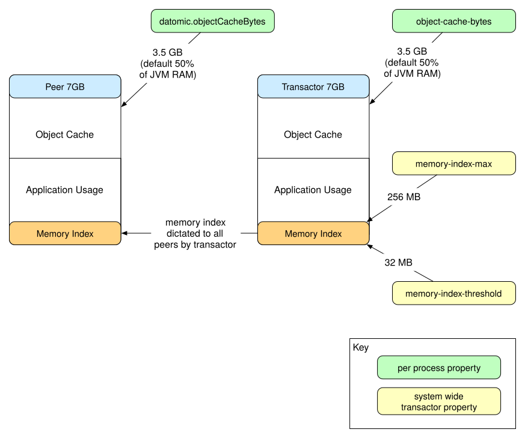

<a id="content"></a>

<a id="capacity-planning"></a>

# Capacity Planning

This page covers capacity planning for Datomic, in the following areas:

- [Transactor memory](#transactor-memory)
- [Data imports](#data-imports)
- [Peer memory](#peer-memory)
- [Transaction performance](#transaction-performance)
- [Indexing](#indexing)
- [Multiple databases](#multiple-databases)
- [DynamoDB](#dynamodb)
- [Storage size](#storage-size)

References in square brackets, e.g. *\[StoragePutMsec\]*, are to Datomic [metrics](../06-monitoring-and-performance/monitoring-and-performance.md).

<a id="outline-container-transactor-memory"></a>

<a id="transactor-memory"></a>

## Transactor Memory

<a id="text-transactor-memory"></a>

Transactor memory is used for three key things:

- The memory index holds transaction data that has been logged to disk but not yet committed to a disk index
- The object cache caches recently used values from the database index
- Transaction functions can use memory in arbitrary ways



The following [system properties](../11-system-properties/system-properties.md) in the transactor properties file determine how memory is allocated among the above tasks:

| Setting                | Description                                  |
|------------------------|----------------------------------------------|
| memory-index-threshold | Start building index when this is reached    |
| memory-index-max       | Apply back pressure to let indexing catch up |
| object-cache-max       | Size of the object cache                     |

These settings must be included in the transactor properties file. The *config/samples* directory contains property file examples for both development and production use.

Uncomment the appropriate settings and then launch *bin/transactor* with enough memory to cover the sum of *memory-index-max* and *object-cache-max*, plus plenty of headroom for the process itself.

The actual amount of memory used by the memory index depends on the recent transaction history. When a system is experiencing high write volume, the memory index can grow up to *memory-index-max*. Under low write volume, the memory index will range between zero and a little more than *memory-index-threshold*.

By default, the transactor launches with 1G RAM, which works well with the recommended settings for development use.

``` sh
bin/transactor my-dev-transactor.properties
```

The sample production settings are designed to work with 4G of RAM. When launching a transactor for production, always explicitly specify the *Xmx* and *Xms* flags:

``` sh
bin/transactor -Xmx4g -Xms4g my-production-transactor.properties
```

Most applications will never need to change these settings.

<a id="outline-container-memory-index-defaults"></a>

<a id="memory-index-defaults"></a>

### Prefer Memory Index Defaults

<a id="text-memory-index-defaults"></a>

Adaptive indexing automatically manages the memory index for you, and should generally be used with the default settings, regardless of the the shape of your transaction load.

``` sh
memory-index-threshold=32m
memory-index-max=512m
```

If you have an older transactor properties file with different memory-index settings, change them to match the settings above.

<a id="outline-container-tuning-object-cache"></a>

<a id="tuning-object-cache"></a>

### Tuning the Object Cache

<a id="text-tuning-object-cache"></a>

The following scenarios may warrant adjusting the [*object-cache-max*](../11-system-properties/system-properties.md) setting on the transactor:

- Small Heaps  
  <a id="text-small-heaps"></a>

  If the transactor runs with a small heap, you may want to turn down [*object-cache-max*](../11-system-properties/system-properties.md). The most common scenario for this is development and testing and the example transactor properties include settings for a 1GB heap dev transactor.
- Uniqueness Checks  
  <a id="text-uniqueness-checks"></a>

  If a database attribute is unique, then every datom using that attribute implies a lookup from the transactor to perform the uniqueness check. You can improve transaction performance by making sure the object cache is large enough to hold the hot ranges of unique attributes entirely in memory.

  Note that large caches can cause GC issues, so there is a tradeoff here.
- Transaction Functions  
  <a id="text-transaction-functions"></a>

  If your transaction functions allocate large amounts of memory, you may need to reduce the [*object-cache-max*](../11-system-properties/system-properties.md) to leave space for this activity. Reduce the amount of memory your transaction function allocates, or eliminate the need to use the transaction function by adjusting your data model.

<a id="outline-container-data-imports"></a>

<a id="data-imports"></a>

## Data Imports

<a id="text-data-imports"></a>

There are several things to consider when performing data imports:

<a id="outline-container-plan-for-back-pressure"></a>

<a id="plan-for-back-pressure"></a>

### Plan for Back Pressure

<a id="text-plan-for-back-pressure"></a>

The transactor will automatically apply back pressure during sustained heavy write loads such as imports. When the amount of novelty accumulated by the transactor exceeds *memory-index-max* before an indexing job can be completed, the transactor will radically slow the rate at which it processes transactions.

Import jobs should use [transact-async](../../../04-apis/01-peer-api-clojuredoc/peer-api-clojuredoc.md#datomic.api/transact-async) and be willing to wait for several minutes for a transaction to complete. Once the indexing job is finished, transaction speeds will return to normal.

During imports, you can safely ignore *\[AlarmBackPressure\]* alarms, since they are expected.

<a id="outline-container-organizing-import-transactions"></a>

<a id="organizing-import-transactions"></a>

### Organizing Import Transactions

<a id="text-organizing-import-transactions"></a>

Two practices will help make imports as fast as possible: pipelining and batching.

- To pipeline transactions, use Connection.transactAsync to send more

than one transaction at a time. It is still important to wait on the transaction futures, but you can use e.g. a semaphore to keep ten transactions in flight at once.

- If the groupings of datoms into transactions during an import do not

have semantic significance for your data, you are free to batch data into transaction sizes that are optimal for import data size and speed.

Pipelining 20 transactions at a time with 100 datoms per transaction is a good starting point for efficient imports.

<a id="outline-container-storage-size-and-write-throughput"></a>

<a id="storage-size-and-write-throughput"></a>

### Storage Size and Write Throughput

<a id="text-storage-size-and-write-throughput"></a>

Temporarily provision a larger system than you will later use in production. E.g. when running on DDB, your import will be throttled by your provisioned write volume, so turn it up to go faster.

For the fastest imports, you will want DDB writes set to 1000 or more.

<a id="outline-container-clean-up-after-import"></a>

<a id="clean-up-after-import"></a>

### Clean up After Import

<a id="text-clean-up-after-import"></a>

After a large import, call [gc-storage](../../../04-apis/01-peer-api-clojuredoc/peer-api-clojuredoc.md#datomic.api/gc-storage) to recover storage space.

<a id="outline-container-peer-memory"></a>

<a id="peer-memory"></a>

## Peer Memory

<a id="text-peer-memory"></a>

Peers need memory for three things:

- Their copy of the memory index (up to *memory-index-max*)
- Their own [object cache](../09-memory-and-caching/memory-and-caching.md#object-cache)
- Application use

For example, 4GB of RAM on all transactor and peer processes would have the following memory breakdown:

- 2GB (50% of available RAM) for the object cache
- 512MB for memory index max
- 1.5GB remaining for the application

Note that peer processes may use up to the *memory-index-max* per connected database to hold the live [memory index](../09-memory-and-caching/memory-and-caching.md#memory-index).

To adjust this balance, set the *datomic.objectCacheMax* [system property](../11-system-properties/system-properties.md) before loading the peer library, e.g.

``` clojure
// on startup
(System/setProperty "datomic.objectCacheMax" "256m")
```

<a id="outline-container-small-databases"></a>

<a id="small-databases"></a>

### Small Databases

<a id="text-small-databases"></a>

If your database is very small, you can get extraordinary read performance by setting *datomic.objectCacheMax* high enough that the entire database fits in the object cache on the peers.

<a id="outline-container-transaction-performance"></a>

<a id="transaction-performance"></a>

## Transaction Performance

<a id="text-transaction-performance"></a>

Datomic transactions enforce the invariants of a Datomic database. To improve the performance of Datomic transactions, you can:

- Give Datomic more resources, e.g. [more CPUs](#more-cpus), [memcached](#cache-for-transactions), or [more memory](#transactor-memory)
- Do less work, e.g. [prefer squuids](#prefer-squuids), [queue transactions](#queue-transactions), or [store what you need](#store-what-you-need)

<a id="outline-container-more-cpus"></a>

<a id="more-cpus"></a>

### More CPUs

<a id="text-more-cpus"></a>

Transactors can take advantage of multiple CPUs, both for transaction processing and indexing. If your monitoring shows that a transactor process is using most of its CPUs, increasing the number of CPUs will improve all aspects of transactor performance.

<a id="outline-container-cache-for-transactions"></a>

<a id="cache-for-transactions"></a>

### Use Memcached and/or Valcache

<a id="text-cache-for-transactions"></a>

Transactions must consider the existing state of the database, e.g. to enforce uniqueness constraints and cardinality rules. As soon as your database is larger than memory, Datomic will automatically swap in segments of the database as needed. In a basic configuration, this means reading in segments from storage. When you add [memcached](../09-memory-and-caching/memory-and-caching.md#memcached) and/or [valcache](../13-valcache/valcache.md) to a system, these reads can be an order of magnitude faster.

<a id="outline-container-prefer-squuids"></a>

<a id="prefer-squuids"></a>

### Prefer Squuids to Random UUIDs

<a id="text-prefer-squuids"></a>

Prefer [squuid](../../../04-apis/01-peer-api-clojuredoc/peer-api-clojuredoc.md#datomic.api/squuid) for UUID generation.

When a transaction submits a datom whose attribute is unique, Datomic must test it against existing datoms with that attribute. Since many UUID generators are deliberately random, this test has very poor locality, consuming (or even thrashing) a large number of segments in the [object cache](#transactor-memory). *(d/squuid)* generates UUIDs with some temporal locality.

<a id="outline-container-queue-transactions"></a>

<a id="queue-transactions"></a>

### Queue Transactions

<a id="text-queue-transactions"></a>

Many database systems support a variety of workloads, with varying degrees of priority. For example, a common pattern is a system that has an ongoing load of user-facing transactions, plus one or more batch jobs that import data from other systems.

Submit transactions directly only where you need a low-latency, synchronous response. Put all other transactions on a queue, and limit their submission rate so that high-priority transactions achieve better latency and throughput.

<a id="outline-container-store-what-you-need"></a>

<a id="store-what-you-need"></a>

### Store What You Need

<a id="text-store-what-you-need"></a>

Because Datomic stores time information, a common modeling mistake is to assume that **everything** temporal belongs in Datomic–particularly high volume, non-transactional operational logs.

Datomic is designed as a system-of-record database. Put your records in Datomic, and put your operational logs somewhere else.

If your system stores information whose past values are unimportant, declare those attributes as [noHistory](../../../06-reference/01-schema/01-schema-reference/schema-reference.md).

<a id="outline-container-indexing"></a>

<a id="indexing"></a>

## Indexing

<a id="text-indexing"></a>

On an ongoing basis, Datomic must perform [background indexing jobs](../../../06-reference/04-indexes/02-background-indexing/background-indexing.md) to copy recent changes from memory into the persistent index. An indexing job is triggered automatically when the transactor's *memory-index-threshold* accumulates in memory.

> You can also explicitly request an indexing job by calling [request-index](../../../04-apis/01-peer-api-clojuredoc/peer-api-clojuredoc.md#datomic.api/request-index).

Once indexing has begun, the transactor will continue to process transactions until *memory-index-max* is reached. This limit protects peers and the transactor from devoting too much memory to the in-memory index. Once this limit is reached, the transactor will **radically** throttle transactions, and issue *\[Alarm\]* and *\[AlarmBackPressure\]* metrics once per minute.

To check how well Datomic is keeping up with your system load, follow the *\[MemoryIndexMB\]* metric. If this metric reaches the midway point (default 144MB) between *memory-index-threshold* and *memory-index-max* during normal operation, your system has enough load that you need to plan carefully to avoid back pressure.

On large systems, you may want to [prefer squuids](#prefer-squuids) and enable [index-parallelism](#index-parallelism).

<a id="outline-container-index-parallelism"></a>

<a id="index-parallelism"></a>

### Index Parallelism

<a id="text-index-parallelism"></a>

By default, background indexing is mostly serial. You can request more parallelism in indexing by setting the `index-parallelism` [transactor](../11-system-properties/system-properties.md#transactor-properties) property, available in 0.9.5981 and later. `index-parallelism` defaults to 1.

If you have high write volumes, a transactor with plenty of CPUs to spare, and are using a scalable storage service, you can set `index-parallelism` as high as 8 to speed up indexing jobs:

``` sh
index-parallelism=8
```

Only part of the indexing job is parallelized, so you will not see a linear increase in CPU usage when you increase `index-parallelism`.

<a id="outline-container-multiple-databases"></a>

<a id="multiple-databases"></a>

## Multiple Databases

<a id="text-multiple-databases"></a>

When you serve multiple databases with Datomic, you have a choice of provisioning separate transactor pairs per database, or colocating multiple databases on a single transactor pair. Similarly, you can provision peer processes to serve a single database or many, including possibly connecting one peer to multiple databases on different transactors.

When you serve multiple databases from the same (peer or transactor) process, those databases share *and compete for* that process's resources. In particular:

- A process must hold the **sum** of every database's [memory index](#transactor-memory). For a single-database process, this will be a small fraction of the total heap, but if there are multiple databases with high write volume, the memory indexes could strain or exhaust the heap.
- All databases compete for space in the [object cache](#transactor-memory) to efficiently serve queries.
- Transactions and queries compete for CPUs.
- Garbage collection pauses have a correlated impact across all databases.
- If the process has an operational problem, all databases are impacted.

For all these reasons, you should usually give large and/or mission-critical databases their own dedicated transactor and peer processes. Conversely, it is reasonable to share and conserve resources by hosting many low-volume, non-critical databases on a single system. For example, it is not uncommon to host hundreds of small databases on a staging or continuous integration system.

<a id="outline-container-dynamodb"></a>

<a id="dynamodb"></a>

## DynamoDB

<a id="text-dynamodb"></a>

DynamoDB allows you to independently specify read and write capacity. As a first rule of thumb, spend at least as much money on read+write capacity as you do on the transactor instance.

The table below shows starter DDB settings for a few common EC2 instance sizes:

| Instance size | DDB read | DDB write | Write concurrency |
|---------------|----------|-----------|-------------------|
| m3.medium     | 250      | 125       | 2                 |
| m3.large      | 500      | 250       | 2                 |
| m3.xlarge     | 1200     | 600       | 3                 |
| c3.xlarge     | 1500     | 750       | 4                 |

<a id="outline-container-tuning-dynamodb-writes"></a>

<a id="tuning-dynamodb-writes"></a>

### Tuning DynamoDB Writes

<a id="text-tuning-dynamodb-writes"></a>

The *\[StorageBackoff\]* metric measures time spent backing off and retrying storage operations. Most storage will rarely (if ever) trigger this metric, but DynamoDB will trigger it frequently as you near your provisioning limit.

Every *\[StorageBackoff\]* implies that an operation is being forced to wait, and that your system could potentially have lower latency and more throughput by provisioning more storage. This does **not** mean that you should provision a system to eliminate all backoffs.

I/O may not be your bottleneck, so you should correlate storage backoffs with application-level performance, e.g. the *transaction* metric before deciding to increase provisioning.

<a id="outline-container-tuning-write-concurrency"></a>

<a id="tuning-write-concurrency"></a>

### Tuning Write Concurrency

<a id="text-tuning-write-concurrency"></a>

The *write-concurrency* setting in the transactor properties file sets a soft limit on the number of concurrent writes to storage that Datomic will attempt. The minimum *write-concurrency* is two (2).

When using DynamoDB, match *write-concurrency* to your write provisioning, with one thread per 200kb/sec of write, e.g. a system with DynamoDB write set to 800 might choose the (default) write-concurrency of 4. *write-concurrency* should be set commensurate with the _lowest_ expected DynamoDB write provisioning to be used.

<a id="outline-container-minimum-provisioning"></a>

<a id="minimum-provisioning"></a>

### Minimum Provisioning

<a id="text-minimum-provisioning"></a>

If you fail to provision enough DynamoDB capacity, your *\[StoragePutMsec\]* maximum times will spike significantly as you hit your throughput limit and the storage library automatically adds exponential backoff and retry to your writes. If your *\[StoragePutMsec\]* Maximum time exceeds one second, you are so far past your provisioned limit that the storage library may eventually fail a write, killing your transactor.

<a id="outline-container-dynamodb-reads"></a>

<a id="dynamodb-reads"></a>

### DynamoDB Reads

<a id="text-dynamodb-reads"></a>

If you are regularly being throttled on DynamoDB reads, expand the size of your Memcached cluster to serve reads from there instead.

<a id="outline-container-dynamodb-metrics"></a>

<a id="dynamodb-metrics"></a>

### DynamoDB Metrics

<a id="text-dynamodb-metrics"></a>

DynamoDB has its [own metrics](https://docs.aws.amazon.com/AmazonCloudWatch/latest/monitoring/aws-services-cloudwatch-metrics.html), including the very useful *\[ThrottledRequests\]* Samples, which tell you how many times a system has exceeded provisioned capacity. You can set an [alarm](https://docs.aws.amazon.com/AmazonCloudWatch/latest/monitoring/AlarmThatSendsEmail.html) on this metric to be notified if your system starts to exceed its provisioned capacity.

<a id="outline-container-storage-size"></a>

<a id="storage-size"></a>

## Storage Size

<a id="text-storage-size"></a>

Datomic uses all storages similarly – to store log and index segments. These segments range up to about 50kb each. The database is a set of trees of these segments. You can model the leaf segments of the trees as arrays of datoms. How many datoms fit in a segment? It depends first on the value types.

Larger value types generally take up more space than smaller ones. Next, the [Fressian](https://github.com/Datomic/fressian) format has packed encodings of, e.g. small numbers etc, as well as options for semantic compression that we leverage to help mitigate the datom encoding (E, A, and T parts) above and beyond the Values. Finally, all of the segments are compressed (with, e.g. zip), further reducing their size. In practice, for non-large values, we see anywhere from 1,000 to 20,000 datoms/segment.

Expect every datom to be stored at least 3 times:

- Once in the transaction log
- Once in an EAVT-sorted index
- Once in an AEVT index

For attributes of ref type, the datom is further stored in a VAET index for reverse lookup. Finally, for attributes with index or unique properties, the datom is also stored in an AVET index. Each index type might have more or less effective compression depending on the redundancy present in the data.

<a id="outline-container-separated-garbage-collection"></a>

<a id="separated-garbage-collection"></a>

## Separated Garbage Collection Tool for Datomic

<a id="text-separated-garbage-collection"></a>

`gc-db` runs [gc-storage](../../../04-apis/01-peer-api-clojuredoc/peer-api-clojuredoc.md#datomic.api/gc-storage) as an independent process.

To invoke the `gc-db` tool, use the following command:

``` sh
bin/run -m datomic.tools.gc-db $db-URI $older-than
```

The tool accepts JVM options. You can also set parallelism (maximum value `128`) for Datomic garbage collection with the *datomic.deleteConcurrency* option. With increased parallelism, it is important to set *datomic.readConcurrency* to double your `deleteConcurrency` value e.g.

``` sh
bin/run -m datomic.tools.gc-db -Ddatomic.deleteConcurrency=8 -Ddatomic.readConcurrency=16 -Xms4g -Xmx4g $db-URI $older-than
```

<a id="outline-container-garbage-collection"></a>

<a id="garbage-collection"></a>

## Garbage Collection for Live Databases

<a id="text-garbage-collection"></a>

During normal operation, no-longer-referenced (garbage) storage segments accumulate, and you should periodically invoke [gc-storage](../../../04-apis/01-peer-api-clojuredoc/peer-api-clojuredoc.md#datomic.api/gc-storage) to clean up. The *gc-storage* operation:

- Is intended to be called infrequently, e.g. once a day and/or after transactor restart
- Does not lock, block, nor even read any live data segments
- Continues in the background on the active transactor until collection is complete or the transactor process terminates
- Can easily keep pace with new garbage when run regularly

> If you use DynamoDB storage, note that the delete operations performed by *gc-storage* count against write provisioning, and you may need to increase provisioning accordingly.

The reason that garbage is not deleted immediately on the creation of a new tree is that not all consumers will immediately adopt the latest tree. *gc-storage* should not be run with a current or recent time, as this has the potential to disrupt index values used by long-running processes. Except during initial import, garbage collection ([gc-storage](../../../04-apis/01-peer-api-clojuredoc/peer-api-clojuredoc.md#datomic.api/gc-storage)) *older-than* value should be at least a month old.

> Note that some storage, like SQL databases, might have their own vacuuming/reclamation facilities that you'll need to run periodically.

Individual storages might add very slight overhead per segment, but in general, a DB should take similar space in any storage (multiplied, of course, by any redundancy factor in the storage subsystem itself). Storage requirements should increase linearly with more (similar) data. So you can load some non-trivial amount of exemplar data, *request-index*, and backup to get an idea of your basis size.

<a id="outline-container-garbage-collection-deleted"></a>

<a id="garbage-collection-deleted"></a>

## Garbage Collection for Deleted Databases

<a id="text-garbage-collection-deleted"></a>

When you delete a database with [delete-database](../../../04-apis/01-peer-api-clojuredoc/peer-api-clojuredoc.md#datomic.api/delete-database), the database immediately becomes unavailable for use. As a separate step, you may later choose to reclaim all storage associated with deleted databases on a system. There are two ways to do this, corresponding roughly to production and development/testing needs.

<a id="outline-container-garbage-collection-deleted-dev"></a>

<a id="garbage-collection-deleted-dev"></a>

### GC for Deleted Databases in Development and Testing

<a id="text-garbage-collection-deleted-dev"></a>

By far the fastest, easiest, and cleanest mechanism for reclaiming storage is to simply delete the underlying storage mechanism, e.g. the DynamoDB table, the SQL table, etc. Deleting an entire table is a fast operation, and is not subject to any provisioning limits.

Clean delete and recreate at the storage level is strongly encouraged for all development, testing, and staging use cases.

<a id="outline-container-garbage-collection-deleted-production"></a>

<a id="garbage-collection-deleted-production"></a>

### GC for Deleted Databases in Production

<a id="text-garbage-collection-deleted-production"></a>

It may be impossible to delete the underlying storage in a production system, as that storage is also being used for other Datomic databases, or for other uses entirely.

To reclaim deleted databases in a storage that is also under ongoing use, Datomic provides the *gc-deleted-dbs* command-line API, taking a system URI (a Datomic URI with database name omitted) as an argument. The following command will delete storage associated with any databases that have been deleted on the *foo* system:

``` sh
bin/datomic gc-deleted-dbs datomic:ddb://us-east-1/foo
```

Such garbage collection competes for resources with ongoing use of the system. You can reduce garbage collection's impact by pacing it with the *datomic.gcStoragePaceMsec* option, e.g.

``` sh
bin/datomic -Ddatomic.gcStoragePaceMsec=10 gc-deleted-dbs datomic:ddb://us-east-1/foo
```

The *datomic.gcStoragePaceMsec* setting defaults to no pacing, allowing GC to go as fast as a single thread can write. If you need to slow the pace of GC down, setting this value to an integer will cause GC to pause that many milliseconds between operations.

You can kill a *gc-deleted-dbs* process and restart it later with no adverse affects. Note that:

Calling *gc-deleted-dbs* has two weaknesses when compared to deleting the underlying storage.

- Datomic must walk all the data structures associated with deleted databases, which takes time proportional to the size of the deleted data
- Datomic does not mark all garbage in all cases, so *gc-deleted-dbs* will reclaim most (but not necessarily all) storage used by deleted databases
