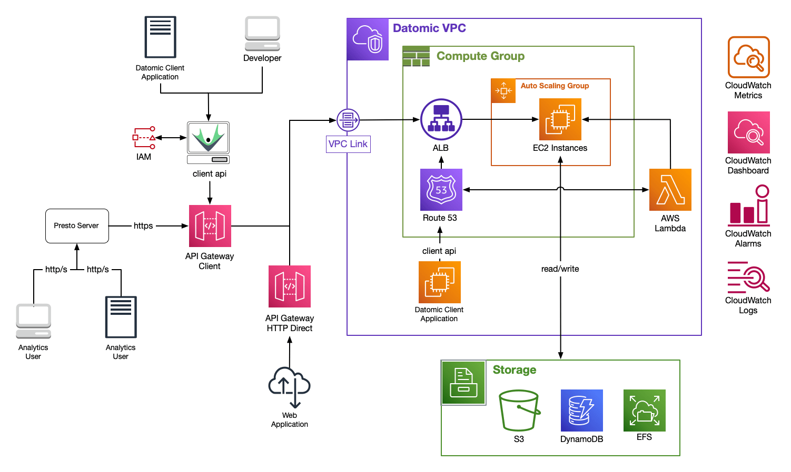
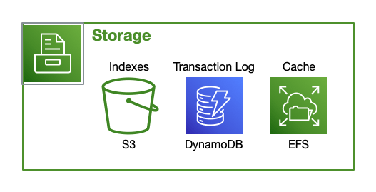
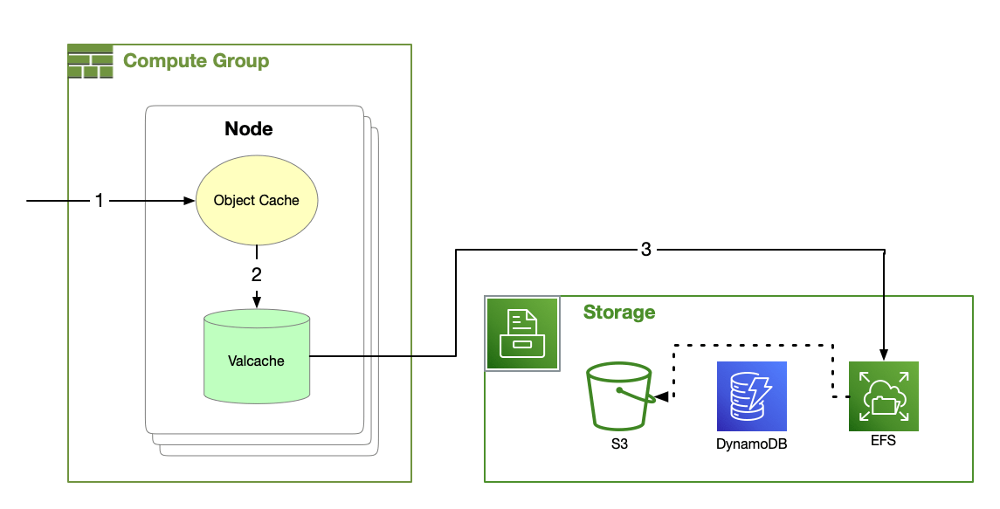
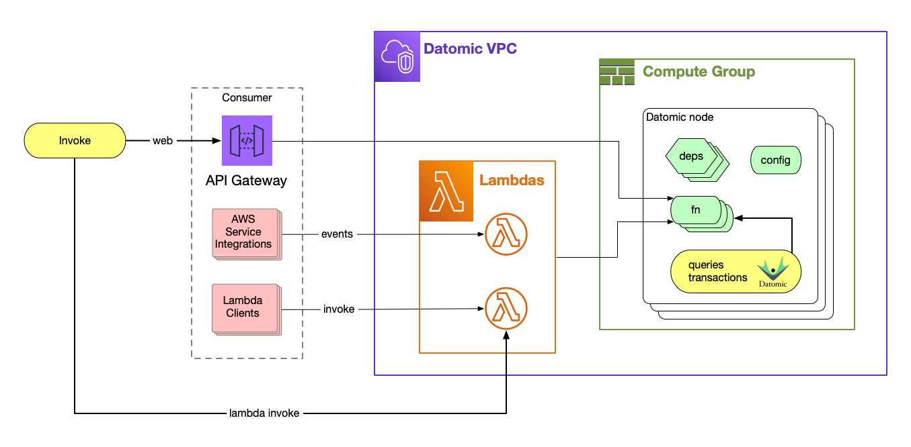

# Datomic Cloud Architecture

Datomic's data model – based on immutable facts stored over time – enables a physical design that is fundamentally different from traditional [RDBMSs](https://en.wikipedia.org/wiki/Relational_database_management_system). Instead of processing all requests in a single server component, Datomic [distributes](#compute-groups) [ACID](../../../06-reference/02-transactions/05-acid/acid.md) transactions, query, datalog and pull, [indexing](#indexes), [caching](#caching), and [SQL analytics support](#analytics) to provide [high availability](#ha), [horizontal scaling, and elasticity](#query-groups). Datomic also allows for [dynamic assignment of compute resources](#query-groups) to tasks **without** any kind of pre-assignment or [sharding](https://en.wikipedia.org/wiki/Shard_(database_architecture)).

Datomic is designed from the ground up to run on AWS. Datomic automates AWS [resources](#minimal-admin), [deployment](#api-gateway) and [security](#security) so that you can [focus on your application](#applications).

The [Day of Datomic videos](https://www.youtube.com/watch?v=p-C_xaKhOHg&t=288s) discuss Datomic architecture in detail.

## System

A complete Datomic installation is called a system. A system consists of [storage resources](#storage-resources) plus one or more [compute groups](#compute-groups):

## Storage Resources

The durable elements managed by Datomic are called Storage Resources, including:

- The [DynamoDB](https://aws.amazon.com/dynamodb/) Transaction Log
- [S3 storage](https://aws.amazon.com/s3/) of Indexes
- An [EFS](https://docs.aws.amazon.com/efs/latest/ug/performance.html) cache layer
- Operational logs
- A [VPC](https://aws.amazon.com/vpc/) and subnets in which computational resources will run

These resources are retained even when no computational resources are active, so you can shut down all the active elements of Datomic while maintaining your data.

### How Datomic Uses Storage

Datomic leverages the attributes of multiple AWS storage options to satisfy its semantic and performance characteristics. As indicated in the [tables below](#stratified-durability), different AWS storage services provide different latencies, costs, and semantic behaviors.

Datomic utilizes a stratified approach to provide high performance, low cost, and strong reliability guarantees. Specifically:

- [ACID](../../../06-reference/02-transactions/05-acid/acid.md) semantics are ensured via [conditional writes](https://docs.aws.amazon.com/amazondynamodb/latest/developerguide/WorkingWithItems.html#WorkingWithItems.ConditionalUpdate) with [DynamoDB](https://aws.amazon.com/dynamodb/)
- [S3](https://aws.amazon.com/s3/) provides highly reliable low cost persistence
- [EFS](https://docs.aws.amazon.com/efs/latest/ug/performance.html) and [EC2](https://aws.amazon.com/ec2/) instance SSD storage provide very fast local caching

### Stratified Durability

| Purpose           | Technology           |
|-------------------|----------------------|
| ACID              | DynamoDB             |
| Storage of Record | S3                   |
| Cache             | Memory \> SSD \> EFS |
| Reliability       | S3 + DDB + EFS       |

| Technology   | Properties                      |
|--------------|---------------------------------|
| DynamoDB     | Low-latency CAS                 |
| S3           | Low-cost, high reliability      |
| EFS          | Durable cache survives restarts |
| Memory & SSD | Speed                           |

This multi-layered persistence architecture ensures high reliability, as data missing from any given layer can be recovered from deeper within the stack – as well as excellent cache locality and latency via the multi-level distributed cache.

## Indexes

Databases provide not just storage, but *leverage* over data. This leverage comes from two sources: useful indexes into data, and powerful query languages that use those indexes.

In Datomic Cloud, every datom is automatically indexed in [four different sort orders](../../../04-apis/07-index-apis/index-apis.md), to automatically support multiple styles of data access: row-oriented, column-oriented, document-oriented, key/value, and graph. This makes it possible for the same database to serve a variety of usage patterns without the need for per-use custom configuration or data transformation.

Datomic's [datalog query](../../../06-reference/03-query-and-pull/01-executing-queries/executing-queries.md) automatically uses the appropriate indexes. Datomic indexes are transparent to application code and configuration.

## Log

The Datomic Cloud log is indelible, chronological, transactional, and accessible.

- **Indelible:** the log accumulates new information and never removes information. Where update-in-place databases would delete, Datomic instead *adds* a new [retraction](../../../06-reference/02-transactions/02-transaction-data/transaction-data.md).
- **Chronological:** the log contains the entire history of the database, in time order.
- **Transactional:** Datomic writes are *always* [ACID](../../../06-reference/02-transactions/05-acid/acid.md) transactions, recorded with compare-and-swap operations against DynamoDB.
- **Tangible:** rather than being an implementation detail, the log is part of Datomic's information model. You can query the log directly with the log API.

## Large Data Sets

Datomic is designed for use with data sets much larger than can fit in memory, while providing in-memory performance for query to the extent that memory is available. To support large data sets, Datomic:

- Stores indexes as shallow trees of segments, where each segment typically contains thousands of datoms.
- Merges index trees with an in-memory representation of recent change so that all processes see up-to-date and [consistent](../../../06-reference/02-transactions/05-acid/acid.md#consistency) indexes.
- Creates new index trees only occasionally, via background indexing jobs.
- Uses an adaptive indexing algorithm that has a sub-linear relationship with total database size.
- Transparently manages a multi-layer [cache](#caching) of immutable segments, so that applications can achieve in-memory performance to the degree that their working sets *do* fit into memory.

## Compute Groups

A compute group is an independent unit of computation, scaling, code deployment, and caching. Every Datomic system has a [primary compute group](#primary-compute-resources), plus zero or more [query groups](#query-groups).

Every compute group comprises one or more [compute nodes](#nodes), and has its own [Auto Scaling group](https://docs.aws.amazon.com/autoscaling/ec2/userguide/AutoScalingGroup.html) and [Application Load Balancer](https://docs.aws.amazon.com/elasticloadbalancing/latest/application/introduction.html). Because databases are immutable, compute group instances require no coordination for query.

## Primary Compute Stack

Every running system has a single primary compute stack which provides computational resources and a means to access those resources. A Primary Compute Stack consists of:

- [Compute nodes](#nodes) dedicated to transactions, indexing, and caching.
- [Route53](https://docs.aws.amazon.com/general/latest/gr/rande.html) and [Application Load Balancer](https://aws.amazon.com/elasticloadbalancing/application-load-balancer/) (ALB) endpoints

## Query Groups

Query groups are valuable if users of your data differ in any of the following ways:

- Application code
- Computational requirements
- Cacheable working sets
- Scaling requirements

A *query group* is a compute group that:

- Extends the abilities of an existing Datomic system
- Is a deployment target for its own distinct application code
- Has its own clustered [nodes](#nodes)
- Manages its own working set cache
- Can *elastically* auto-scale application reads without any up-front planning or sharding

Query groups deliver the entire semantic model of Datomic. In particular:

- Client code does not know or care whether it is talking to the primary compute group or to a query group
- Query groups are [peers](#peers) with the primary compute group

You can add, modify, or remove query groups at any time. For example, you might initially release a transactional application that uses only a primary compute group. Later, you might decide to split out multiple query groups:

- An autoscaling query group for transactional load
- A fixed query group with one large instance for analytic queries
- A fixed query group with a smaller instance for support

## Nodes

[Compute groups](#compute-groups) manage one or more *compute nodes*. Nodes are [EC2 instances](https://docs.aws.amazon.com/AWSEC2/latest/UserGuide/concepts.html) that serve [ACID transactions](../../../06-reference/02-transactions/05-acid/acid.md) , [datalog query](../../../06-reference/03-query-and-pull/01-executing-queries/executing-queries.md), and [ion](../../../07-datomic-cloud-ions/02-ions-reference/ions-reference.md) applications. Nodes also perform necessary background tasks such as indexing.

## Peer Processes

In Datomic Cloud, every compute node is a *peer*, that is, all nodes have coequal access to the data. A peer process:

- Implements the Datomic Client API
- Transparently [caches](#caching) data
- Queries with memory locality

[Ion applications](#applications) runs in-process with Datomic, and gain all the locality benefits of a peer.

Peer processes are in contrast to a traditional relational database, where servers are closer to the data, and clients are further away.

## Caching

Datomic caches improve performance without requiring any action by developers or operators. Datomic's caches:

- Require no configuration
- Are transparent to application code
- Contain segments of [index](../../../04-apis/07-index-apis/index-apis.md) or [log](../../../04-apis/09-log-api/log-api.md), typically a few thousand datoms per segment
- Contain only immutable data
- Are always consistent
- Are for performance only, and have no bearing on [transactional guarantees](../../../06-reference/02-transactions/05-acid/acid.md)

Datomic's cache hierarchy includes the [object cache](#object-cache), [EFS cache](#efs-cache) and optionally [Valcache](#valcache) when using [i3 instances](../03-growing-your-system/growing-your-system.md#valcache).

### Object Cache

Nodes maintain an LRU cache of segments as Java objects. When a node needs a segment, Datomic looks in the object cache first. If a segment is unavailable in the object cache, Datomic will look next to the Valcache [if it's available](../03-growing-your-system/growing-your-system.md#valcache).

Because each process maintains its own object cache, a process will automatically adjust over time to its workload.

### Valcache

Primary Compute Nodes [on i3 instance types](../03-growing-your-system/growing-your-system.md#valcache) maintain a *Valcache*. Valcache implements an immutable subset of the Memcached API and maintains an LRU cache backed by fast local SSDs.

If a segment is unavailable in Valcache, Datomic will look next to the EFS cache.

### EFS Cache

The EFS cache contains the entirety of all indexes for all databases. Datomic uses the EFS cache to populate the smaller and faster Valcache and object cache, without the latency of reading from S3.

If a segment is unavailable in the EFS cache, Datomic will load the segment from S3 and repair the EFS cache.

## High Availability

Datomic [storage](#storage-resources) and [caching](#caching) are built from components that are automatically distributed and highly available, with no single point of failure.

Datomic compute nodes run in Auto Scaling groups. Compute groups are automatically highly available when they are [configured with more than one node](../../01-pro/07-high-availability/high-availability.md).

## Applications

Datomic [ions](../../../07-datomic-cloud-ions/02-ions-reference/ions-reference.md) provides a complete solution for Clojure application deployment on AWS. In particular, you can:

- [Develop and test with real-time feedback at a local REPL](../../../07-datomic-cloud-ions/02-ions-reference/ions-reference.md#best-practices)
- Deploy to AWS [with no downtime](../../../07-datomic-cloud-ions/02-ions-reference/ions-reference.md#deploy)
- Expose functions [as AWS Lambdas](../../../07-datomic-cloud-ions/02-ions-reference/ions-reference.md#lambda-ion) without using the AWS Lambda API
- Expose functions [as web services](../../../07-datomic-cloud-ions/02-ions-reference/ions-reference.md#web-ion)
- Deploy [multiple applications](../03-growing-your-system/growing-your-system.md#dev-workflow) that share a common Datomic system
- [Elastically scale](../03-growing-your-system/growing-your-system.md#query-group) your entire application instead of many separate elements
- Reproducible deploy across [different development stages](../03-growing-your-system/growing-your-system.md#dev-workflow)

## Security

Datomic is designed to follow [AWS security best practices](https://aws.amazon.com/answers/security/aws-securing-ec2-instances/):

- Datomic client authentication is performed using [AWS HMAC](http://docs.aws.amazon.com/AWSECommerceService/latest/DG/HMACSignatures.html), with key transfer via S3, enabling [access control](../06-access-control/access-control.md) governed by IAM roles.
- Data is encrypted at rest using [AWS KMS](https://aws.amazon.com/kms/).
- All Datomic compute groups are isolated in a private [VPC](https://docs.aws.amazon.com/vpc/latest/userguide/what-is-amazon-vpc.html).
- Datomic is exposed to the internet only via optional AWS [API Gateways](#api-gateway).
- Datomic EC2 instances run with an [IAM](https://docs.aws.amazon.com/IAM/latest/UserGuide/introduction.html) role configured for least privilege.
- Datomic requires [minimal administration](#minimal-admin) after initial setup. Administrative tasks are performed in CloudFormation, never by logging in to EC2 instances.

## API Gateways

An [AWS API Gateway](https://aws.amazon.com/api-gateway/) acts as a "front door" to your Datomic system, providing traffic management, authorization and access control, throttling, monitoring, and more.

Datomic will automatically configure a [VPC Link](https://docs.aws.amazon.com/apigateway/latest/developerguide/http-api-vpc-links.html) and API Gateways for internet access to your Datomic system. For each Datomic [compute group](#compute-groups), you can choose to enable one or both of:

- An API Gateway for [Datomic client access](../../../04-apis/04-client-api/additional-client-api-reference/additional-client-api-reference.md)
- An API Gateway for your application via [HTTP Direct](../../../07-datomic-cloud-ions/07-entry-points/entry-points.md#http-direct)

If your system does not require internet accessibility, you can instead access Datomic [from within Datomic's VPC or via VPC peering](../09-vpc-access/vpc-access.md).

## Analytics and SQL

Datomic Cloud supports SQL access for analytics via a connector to [Trino](https://trino.io/). You can [treat any set of Datomic attributes as a SQL table](../../../08-analytics/01-analytics-concepts/analytics-concepts.md#sql-mapping), and access your Datomic data from e.g. [Python](../../../08-analytics/09-python/python.md), [JDBC](../../../08-analytics/12-jdbc/jdbc.md), [R](../../../08-analytics/08-r/r.md), and [many more](../../../08-analytics/13-other-tools/other-tools.md).

Datomic analytics works directly against your live system, and does not require coordination or a separate ETL workflow.

## Minimal Administration

Datomic automates many operational tasks that must be performed manually in many database systems.

- Datomic is at all times its own [complete transactional audit history](#log).
- Datomic automatically creates and manages all [needed indexes](#indexes).
- Because all data is immutable, cache management can be automatic, with no configuration or coordination required. There is no separate cache API, and all database operations benefit from caching automatically.
- Because all processes [are peers](#peers), developers do not have to worry about data locality for query.
- Datomic [durable storage](#storage-resources) requires no configuration and scales automatically.
- Datomic [compute](#compute-groups) can be [scaled manually or automatically](../03-growing-your-system/growing-your-system.md#query-group), and tasks with different needs can have their own dedicated compute resources.

With ions, Datomic can host your entire application, minimizing the surface area of AWS that you have to manage.

Datomic requires minimal administration after setup. Administrative tasks are performed in CloudFormation, never by logging in to EC2 instances.

## Transit

Remote Client API implementations use a wire protocol built on [Transit](https://github.com/cognitect/transit-format), an open-source data interchange format.
