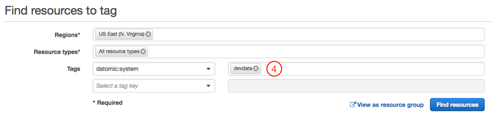
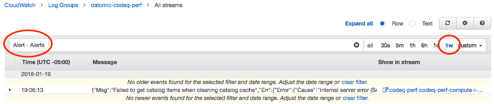
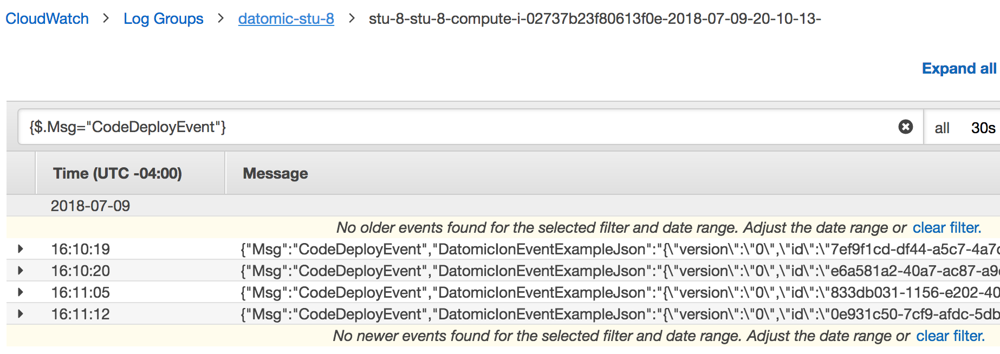
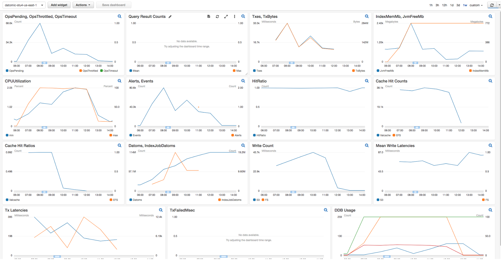
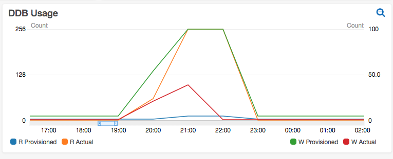

<a id="content"></a>

<a id="monitoring-cloud"></a>

# Monitoring Cloud

AWS CloudWatch provides a powerful set of tools for monitoring a software system running on AWS. With AWS CloudWatch you can:

- Collect and track [CloudWatch metrics](https://docs.aws.amazon.com/AmazonCloudWatch/latest/monitoring/WhatIsCloudWatch.html) – variables that measure the behavior of your system
- Configure [CloudWatch alarms](https://docs.aws.amazon.com/AmazonCloudWatch/latest/monitoring/AlarmThatSendsEmail.html) to notify operations or take other automated steps when potential problems arise
- Monitor, store, and search [CloudWatch logs](https://docs.aws.amazon.com/AmazonCloudWatch/latest/logs/WhatIsCloudWatchLogs.html) across all your AWS resources
- Create [CloudWatch dashboards](https://docs.aws.amazon.com/AmazonCloudWatch/latest/monitoring/CloudWatch_Dashboards.html) that provide a single overview for monitoring your systems

Datomic is fully integrated with all of these AWS monitoring tools. On the producing side, Datomic creates [metrics](#metrics) and [logs](#logs); and on the consuming side, Datomic organizes metrics in [custom dashboards](#dashboards). This document shows how to manage and monitor your Datomic system.

<a id="outline-container-topics"></a>

<a id="topics"></a>

## Topics

<a id="text-topics"></a>

- [Finding Datomic resources by tag](#tags)
- [Searching Cloudwatch logs](#searching-cloudwatch-logs)
- [Metrics produced by Datomic Cloud](#metrics)
- [Logs produced by Datomic Cloud](#logs)
- [Datomic Cloud dashboards](#dashboards)

<a id="outline-container-tags"></a>

<a id="tags"></a>

## Finding Datomic Resources by Tag

<a id="text-tags"></a>

Datomic tags resources it creates with the following tag:

| Tag name       | Tag value   | Resources tagged       |
|----------------|-------------|------------------------|
| datomic:system | System name | All taggable resources |

You can use this tag to locate all the resources associated with a Datomic system. From the [tag editor](https://console.aws.amazon.com/resource-groups/tag-editor/find-resources):

- Under "Regions", Enter one or more AWS regions
- Under "Resource types", choose "All resource types"
- Under "Tags", choose the name "datomic:system" for the tag key
- Under the same row in "Tags", enter a specific system name for the tag value, or leave the tag value blank to find resources for all Datomic systems

[](../../../images/find-resources-to-tag.png)

<a id="outline-container-searching-cloudwatch-logs"></a>

<a id="searching-cloudwatch-logs"></a>

## Searching CloudWatch Logs

<a id="text-searching-cloudwatch-logs"></a>

<a id="outline-container-searching-cloudwatch-logs-cli"></a>

<a id="searching-cloudwatch-logs-cli"></a>

### CLI Tool

<a id="text-searching-cloudwatch-logs-cli"></a>

The [CLI Tools](../07-cli-tools/cli-tools.md) allow you to [list log messages](../07-cli-tools/cli-tools.md#log-list) and [show detail for specific messages](../07-cli-tools/cli-tools.md#log-detail) without necessitating a trip to the AWS console.

<a id="outline-container-searching-cloudwatch-logs-aws"></a>

<a id="searching-cloudwatch-logs-aws"></a>

### AWS Console

<a id="text-searching-cloudwatch-logs-aws"></a>

If you need to view the CloudWatch Logs for a Datomic system:

- Open the [CloudWatch Logs](https://console.aws.amazon.com/cloudwatch/home#logs:) in the AWS Console
- Click on the Log Group named "datomic-{System}", where System is your system name

Each EC2 instance will create a separate log stream. Usually, you will want to search across all log streams:

- Click the "Search Log Group" button
- Click to the right of the filter box to choose an appropriate time window
- Enter a metric filter pattern to scope your search

<a id="outline-container-finding-alerts"></a>

<a id="finding-alerts"></a>

### Finding Alerts

<a id="text-finding-alerts"></a>

The search pattern "Alert - Alerts" will find the text of every alert produced by Datomic. The "Alert" matches each alert, and the "- Alerts" filters redundant summary messages.

The example below demonstrates reviewing a week's worth of alerts. The single event that matches is a transient DynamoDB request failure, so not a problem.

[](../../../images/search-for-alerts.png)

<a id="outline-container-finding-logs"></a>

<a id="finding-logs"></a>

### Finding Logs by Message

<a id="text-finding-logs"></a>

<a id="outline-container-finding-logs-cli"></a>

<a id="finding-logs-cli"></a>

### CLI Tool

<a id="text-finding-logs-cli"></a>

The [CLI Tools](../07-cli-tools/cli-tools.md) allow you to [list logs](../07-cli-tools/cli-tools.md#log-list) between a starting time `--tod` and some minutes in the past `--minutes-back`.

The `datomic log list` command can be piped to grep with the `-B 1` option to be used to find specific logs for a given time period:

```
datomic log list my-datomic-system \
-f all --tod 2019-06-24T03:41:23.491 --minutes-back 150 \
| grep -B 1 CloudWatchMetrics
```

The preceding command will find all logs labeled "CloudWatchMetrics" from March 6th, 2019, 1:11:23.491am until March 6th, 2019, 3:41:23.491am.

<a id="outline-container-finding-logs-aws"></a>

<a id="finding-logs-aws"></a>

### AWS Console

<a id="text-finding-logs-aws"></a>

The image below shows using the CloudWatch [filter and pattern syntax](https://docs.aws.amazon.com/AmazonCloudWatch/latest/logs/FilterAndPatternSyntax.html) to find all logs whose `Msg` is "CodeDeployEvent".

- The brackets `{}` identify the query as a [JSON metric filter](https://docs.aws.amazon.com/AmazonCloudWatch/latest/logs/FilterAndPatternSyntax.html)
- The `$` is a placeholder for log entry as a whole
- The dot syntax scopes the search to the individual key `Msg`

[](../../../images/cast-event.png)

<a id="outline-container-metrics"></a>

<a id="metrics"></a>

## Metrics Produced by Datomic Cloud

<a id="text-metrics"></a>

Datomic compute nodes publish Cloudwatch Metrics as follows:

- Namespace is *DatomicCloud*
- Dimensions are your system name and your compute stack name

Datomic reports a large number of distinct metrics, many of which are useful primarily for Datomic support. The most useful metrics for operators fall into three categories:

- Troubleshooting metrics are helpful for [troubleshooting problems](../13-cloud-troubleshooting/cloud-troubleshooting.md#troubleshooting-nodes)
- Request metrics measure the request load on a system, and can act as [autoscaling triggers](../03-growing-your-system/growing-your-system.md#autoscaling-triggers) for query groups
- Capacity metrics measure the size of the database and indexes, and are helpful in [sizing your primary compute group](../03-growing-your-system/growing-your-system.md#primary-compute-group)

These key metrics are summarized below.

| Metric | Category | Units | Description |
|----|----|----|----|
| Alerts | Troubleshooting | Count | Number of alerts written to Cloudwatch logs |
| JvmFreeMb | Troubleshooting | Mb | Free JVM memory |
| HttpDirectOpsPending | Request | Count | Total number of HTTP direct requests started |
| HttpDirectThrottled | Request | Count | HTTP requests rejected because server too busy |
| HttpEndpointOpsPending | Request | Count | Total number of client requests started |
| HttpEndpointThrottled | Request | Count | Client requests rejected because server too busy |
| Datoms | Capacity | Count | Number of datoms in a database |
| IndexMemMb | Capacity | Mb | Total size of the in-memory indexes on a node |
| NodeDbCount | Capacity | Count | Number of databases being served by node |

<a id="outline-container-logs"></a>

<a id="logs"></a>

## Logs Produced by Datomic Cloud

<a id="text-logs"></a>

Datomic writes Cloudwatch Logs as follows:

- The "Log Group" name is the name of the Datomic system
- Each EC instance will create a log stream named by the convention *{system}-{group}-{instance-id}-{timestamp}*

<a id="outline-container-dashboards"></a>

<a id="dashboards"></a>

## Datomic Cloud Dashboards

<a id="text-dashboards"></a>

When you launch a compute group, it automatically creates a dashboard named `datomic-(name)-(region)` that you can view in the AWS Console.

The [primary compute stack](../01-cloud-architecture/cloud-architecture.md#primary-compute-resources) creates a large dashboard, suitable for viewing on a large ops monitor screen:

[](../../../images/production-dashboard.png)

Each dashboard widget tells a story. For example, the DynamoDB Usage widget tracks [DynamoDB AutoScaling](https://docs.aws.amazon.com/amazondynamodb/latest/developerguide/AutoScaling.html) of reads (left axis) and writes (right axis). In the image below you can see DynamoDB write provisioning (the green line) scaling up for a four-hour period during a batch load, and then scaling back down to almost nothing.

[](../../../images/ddb-autoscaling.png)

A query group stack creates a dashboard that is a subset of the information shown for a primary compute group.
