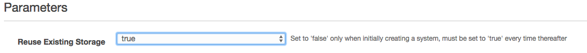

# Upgrading

Datomic Cloud is designed to minimize the upgrade effort, allowing rolling upgrades with zero downtime. To plan and implement an upgrade, you need to:

- Be running [split CloudFormation stacks](../16-splitting-stacks/splitting-stacks.md)
- [Know what version you are running](#know-your-version)
- [Choose a release](#choose-release)
- [Perform the upgrade](#perform-release)

In most situations, [never downgrade Datomic](#do-not-downgrade).

## Know What Version You Are Running

- [Datomic Cloud releases](../../../11-releases/releases.md) have a version number of the form `[CloudFormation-revision]-[code-revision]`.
- A Datomic system comprises one storage stack, plus a separate compute stack for each compute group, each with its own version
- A storage stack does not manage any code, and so its version information includes only a CloudFormation revision
- A compute stack has both a CloudFormation revision and a code revision
- All the stacks for a system should normally be running the same version of Datomic, but this is not mandatory and will not be the case during an upgrade

You can query the revisions for all stacks for a system from the CLI or inspect them in the AWS console:

### From the CLI

- The [`datomic cloud list-systems`](../07-cli-tools/cli-tools.md#list-systems) command lists all systems, with the storage CloudFormation revision under the `storage-cft-version` key.
- The [`datomic system list-instances <system>`](../07-cli-tools/cli-tools.md) command lists all compute instances for a particular system. Each instance will have a `group-cft-version` key with the CloudFormation revision that launched the instance, and a `group-cloud-version` key with the code revision that the instance is currently running.

### From the AWS Console

- Storage stacks have a CloudFormation revision number in the `DatomicCFTVersion` output
- Compute stacks have a CloudFormation revision number in the `DatomicCFTVersion` output, and a code revision number in the `DatomicCloudVersion` output

To view the outputs for a CloudFormation stack:

- Select the name of your system stack in the [CloudFormation console](https://console.aws.amazon.com/cloudformation/home?r#/stacks?filter=active)
- Click on the outputs tab

## Choose a Release

The releases page provides three resources that can help you decide when and how to upgrade:

- The [critical notices](../../../11-releases/releases.md) section contains critical notices for all users. Always read this section.
- The [release history](../../../11-releases/releases.md) table includes a summary column with a brief description of each release.
- The [release notes](../../../11-releases/releases.md) provides a comprehensive list of changes in each release.

Do not [downgrade to older versions](#do-not-downgrade) of Datomic Cloud.

## Perform an Upgrade

Before any upgrade, read the [critical notices](../../../11-releases/releases.md) for all releases between your current release(s) and the release(s) you are upgrading to. These notices may override the generic instructions below.

The documentation for each release lists an upgrade type, Make sure you perform the correct type of upgrade, which can be one of:

- A [compute upgrade](#compute-only-upgrade)
- A [storage upgrade](#storage-only-upgrade)
- A [storage and compute upgrade](#storage-and-compute)

## Storage and Compute Upgrade

If **both** storage and compute are being upgraded:

- [Upgrade storage](#storage-only-upgrade) first
- Then [upgrade compute](#compute-only-upgrade)

## Storage Upgrade

To update a Storage stack:

- Open the [CloudFormation console](http://console.aws.amazon.com/cloudformation/home?#/stacks?filter=active)

- Select your stack via the checkbox or radio button.

- Click the "Update" button.

- Select "Specify an Amazon S3 template URL" and enter the CloudFormation template URL for the version you wish to upgrade to (check the [release page](../../../11-releases/releases.md) for all versions) then click "Next".

- On the "Specify Details" screen, set the "Reuse Existing Storage" option to *true*:

  

- On the "Options" screen, leave all options unchanged.

- On the "Review" screen, click the checkbox stating "I acknowledge that AWS CloudFormation might create IAM resources with custom names" and click "Update".

## Compute Upgrade

If you have more than one compute group, upgrade all of them. Upgrade the primary compute group first and then upgrade your query groups. It is ok to upgrade the query groups in parallel.

To update a Compute Stack:

- Open the [CloudFormation console](http://console.aws.amazon.com/cloudformation/home?#/stacks?filter=active).
- Select your stack via the checkbox or radio button.
- Click the "Update" button.
- Select "Specify an Amazon S3 template URL:" and enter the CloudFormation template URL for the version that you wish to upgrade to (see [Release page](../../../11-releases/releases.md) for all versions) then click "Next".
- On the "Specify Details" screen, leave all options unchanged.
- On the "Options" screen, leave all options unchanged.
- On the "Review" screen, click the mandatory checkboxes that you agree with.

## Do Not Downgrade

Generally speaking, you should never downgrade Datomic CloudFormation templates.

- Newer versions are better: They may contain important fixes.
- Newer versions are compatible: They continue to support the entirety of the API.
- Older versions may be incapable of correctly handling newer features.
- Our support team is better able to help if you are running a recent version.

If you have a need to downgrade Datomic, please [contact support](https://www.datomic.com/support.html) first, and let the Datomic team advise you.
