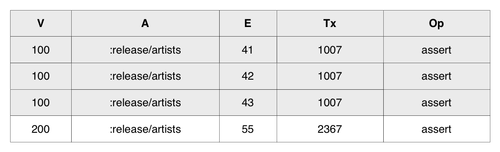
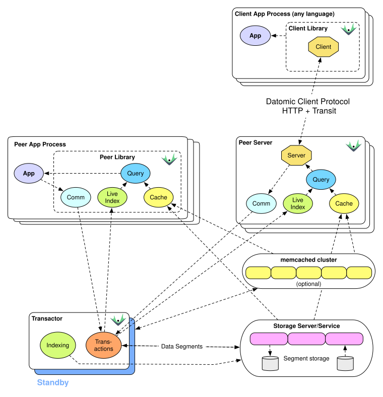

# Indexes

This page provides an explanation of each of the indexes Datomic maintains.

Datomic maintains four indexes that contain ordered sets of datoms. Each of these indexes is named based on the sort order used. E, A, and V are always sorted in ascending order, while T is always in descending order:

### EAVT

The EAVT index provides efficient access to everything about a given entity. Conceptually this is very similar to row access style in a SQL database, except that entities can possess arbitrary attributes rather than being limited to a predefined set of columns.

The example below shows all the facts about entity 42 grouped together:

EAVT is also useful in master or detail lookups, since the references to detail entities are just ordinary values alongside the scalar attributes of the master entity. Datomic assigns entity ids so that when master and detail records are created in the same transaction, they are colocated in EAVT.

### AEVT

The AEVT index provides efficient access to all values for a given attribute, comparable to the traditional column access style. In the table below, notice how all *:release/name* attributes are grouped together. This allows Datomic to efficiently query for all values of the :release/name attribute, because they reside next to one another in this index.

### AVET

The AVET index provides efficient access to particular combinations of attribute and value. The example below shows a portion of the AVET index allowing lookup by *:release/names*.

The AVET index is more expensive to maintain than other indexes, and as such it is the only index that is not enabled by default for Pro. To maintain AVET for an attribute, specify *:db/index* true (or some value for *:db/unique*) when installing or altering the attribute.

All attributes are maintained in the AVET index for Cloud.

### VAET

The VAET index contains only datoms whose attribute has a *:db/valueType* of *:db.type/ref*. This is also known as the reverse index since it allows efficient navigation of relationships in reverse. Assuming that The Beatles are entity 100, the following table shows how their releases would be grouped together in this index:

## Implementation

### Accumulate Only

Datomic is accumulate-only. Information accumulates over time, and change is represented by accumulating the new, not by modifying or removing the old. For example, "removing" occurs not by taking something away, but by adding a new [retraction](../../02-transactions/transactions.md).

At the implementation level, this means that index and log segments are immutable, and can be consumed directly without coordination by any processes in a Datomic system. This is the reason that Datomic processes are called peers - all processes have equivalent access to the information in the system. In addition, because the indexes are immutable, they can be efficiently cached in application processes.

Note that accumulate-only is a semantic property, and is **not** the same as append-only, which is a structural property describing how data is written. Datomic is not an append-only system, and does not have the performance characteristics associated with append-only systems.

### Efficient Accumulation

The Datomic API presents indexes to consumers as sorted sets of datoms or of transactions. However, Datomic is designed for efficient writing at transaction time, and for use with data sets much larger than can fit in memory. To meet these objectives, Datomic:

- Stores indexes as shallow trees of segments, where each segment typically contains thousands of datoms.
- Stores segments, not raw datoms, in storage.
- Updates the datom trees only occasionally, via background indexing jobs.
- Uses an adaptive indexing algorithm that has a sublinear relationship with total database size.
- Merges index trees with an in-memory representation of recent changes so that peers see up-to-date indexes.
- Updates the log for every transaction (the D in [ACID](../../02-transactions/05-acid/acid.md))
- Optimizes log writes using additional data structures tuned to allow O(1) storage writes per transaction.

### Efficient Query

Datomic is able to access datoms at memory speeds for queries whose supporting datoms are already in the cache. This latency is impossible to achieve with client/server databases. When not all supporting datoms are in cache, the wide branching factor of index trees ensures that at most 1-2 reads from storage are necessary to find the necessary segments.

### Real-Time Query

The diagram below shows a cloud-based Datomic instance using DynamoDB for its storage layer. Index usage is visible in the Peer Library and Peer Server sections, where index segments are cached (the yellow "Cache") and merged with recent changes (the green "Live Index") to provide a real-time view to Query.

## Usage Notes

- Attributes that are going to be queried by value need to be marked as *:db/index* *true* or *:db/unique*.
- Datomic's combination of indexes automatically supports queries associated with a number of different storage styles, including row-oriented, column-oriented, document-oriented, K/V, and graph.
- Datomic's EAVT and VAET indexes can automatically navigate entity relationships in both directions, so it is not necessary or recommended to create two attributes that model the same relationship but from different directions.
- Datomic programs do not need to do any API-level caching. Caching is generic, omnipresent, and requires little or no configuration.
- For small enough databases, the entire database is in peer caches, which makes data access faster than in client/server databases.
- The overhead of a peer cache miss is 1-2 segment fetches. From memcached, such fetches are on the order of 1 millisecond. Storages vary from 1 up to 10 or more milliseconds.
- The peer cache insulates Datomic from the performance of the underlying storage system. As a result, it is necessary to weigh storage performance somewhat less heavily than other systems.
- Background indexing needs to be fast enough to keep up with transaction load. To see more about capacity, check the [Capacity](../../../05-operation/01-pro/05-capacity-planning/capacity-planning.md) documentation.
