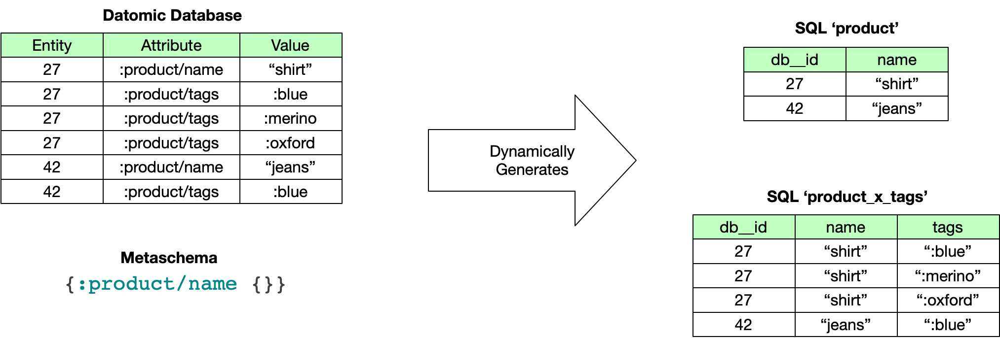

<a id="content"></a>

<a id="metaschema-reference"></a>

# Metaschema Reference

Metaschemas drive the mapping between Datomic entities and attributes and SQL tables & columns. For an overview, check the [analytics overview](../01-analytics-concepts/analytics-concepts.md) page.

[](../../images/metaschema.png)

Even with no Metaschema entries, there will always be auto-generated `db__idents` and `db__attrs` tables which contain information about `:db/idents` and schema. Use `describe` to display their columns.

<a id="outline-container-metaschema-grammar"></a>

<a id="metaschema-grammar"></a>

## Grammar Syntax

<a id="text-metaschema-grammar"></a>

```
'' literal
"" string
[] = list or vector
{} = map {k1 v1 ...}
() grouping
? zero or one
+ one or more
* zero or more
| choice
```

<a id="outline-container-grammar"></a>

<a id="grammar"></a>

## Grammar

<a id="text-grammar"></a>

```
    (whatever-)attr       = keyword naming an attribute in Datomic schema
    sql-name              = string or symbol, alphanumeric or '_' only
​    
    metaschema            = {:tables tables-map :joins joins-map}
​    
    tables-map            = {(membership-attr opts-map)+}
    opts-map              = {name-opt? include-opt? exclude-opt? rename-opt?
                            rename-many-opt? scale-opt?}
    name-opt              = :name sql-name
    include-opt           = :include [attr* ns-wildcard*]
    ns-wildcard           = keyword ending in '/*'
    exclude-opt           = :exclude [attr*]
    rename-opt            = :rename {(attr sql-name)+}}
    rename-many-opt       = :rename-many-table {(card-many-attr sql-name)+}
    scale-opt             = :scale {(bigdec-attr integer)+}
​    
    joins-map             = {(ref-attr table-name)+}
    table-name            = sql-name of table generated by tables-map
```

<a id="outline-container-naming-conventions"></a>

<a id="naming-conventions"></a>

## Naming Conventions

<a id="text-naming-conventions"></a>

Fully namespaced-qualified attr names are required. Attributes without namespaces will be ignored.

Any non-alphanumeric characters in schema, tables, and catalog names will be converted to underscores (`_`). Thus, a system (and catalog properties file) named `my-datomic-system` will be converted to `my_datomic_system` for use in analytics tools.

<a id="outline-container-metaschema-map"></a>

<a id="metaschema-map"></a>

## Metaschema

<a id="text-metaschema-map"></a>

```
metaschema            = {:tables tables-map :joins joins-map}
```

A metaschema is a map with two entries, *:tables* and *:joins*. The *:tables* entry specifies which Datomic attributes are used to create SQL tables. The *:joins* entry enables you to extend these tables by joining in additional columns through ref attributes.

<a id="outline-container-metaschema-tables"></a>

<a id="metaschema-tables"></a>

## Tables

<a id="text-metaschema-tables"></a>

```
tables-map            = {(membership-attr opts-map)+}
```

The `:tables` map maps Datomic attributes to SQL tables by defining which Datomic attributes are considered *membership* attrs.

Each entry in the `:tables` map results in the creation of a SQL table, containing all entities that include that membership attr. The table name is derived from the namespace of the membership attr.

<a id="outline-container-table-options"></a>

<a id="table-options"></a>

## Table Options

<a id="text-table-options"></a>

```
opts-map              = {name-opt? include-opt? exclude-opt? rename-opt?
                        rename-many-opt? scale-opt?}
```

Each entry in the [tables map](#metaschema-tables) requires an options map. The simplest options map is the empty map, `{}`. Each option map *may* contain any combination of:

- A [name option](#name-option)
- An [include option](#include-exclude-option)
- An [exclude option](#include-exclude-option)
- A [rename option](#rename-option)
- A [rename-many option](#rename-option)
- A [scale option](#scale-option)

<a id="outline-container-name-option"></a>

<a id="name-option"></a>

### Name

<a id="text-name-option"></a>

```
name-opt              = :name sql-name
```

The default table name for a SQL table is derived from the namespace of the membership attr. This name can be overridden for any table(s) in the metaschema with the *:name* option. The *sql-name* must include only alphanumeric characters and the underscore (`_`) character.

<a id="outline-container-include-exclude-option"></a>

<a id="include-exclude-option"></a>

### Include and Exclude

<a id="text-include-exclude-option"></a>

```
include-opt           = :include [attr* ns-wildcard*]
ns-wildcard           = keyword ending in '/*'
exclude-opt           = :exclude [attr*]
```

By default, the columns of each SQL table correspond to all Datomic attributes with the same namespace as the membership attr. Additional attributes can be included in any table(s) via the `:include` option. Namespace wildcards may also be used in the *:include* attribute list to include all attributes within that namespace in the table.

Similarly, attributes from the membership attr namespace can be omitted from the SQL table using the `:exclude` option.

<a id="outline-container-rename-option"></a>

<a id="rename-option"></a>

### Renaming Attributes

<a id="text-rename-option"></a>

```
rename-opt            = :rename {(attr sql-name)+}}
rename-many-opt       = :rename-many-table {(card-many-attr sql-name)+}
```

The rename options maps map attribute names to SQL table names.

By default, columns in the SQL tables are named based on Datomic attributes, but they can be renamed using the `:rename` option. Each entry in the `:rename` option map must specify a Datomic attribute and the SQL name to which it will be renamed (alphanumeric and `_` only).

Cardinality-many Datomic attributes are populated in a separate card-many table, named `membership-attr-namespace_x_card-many-attr-name` by default.

This card-many-table can be renamed with the `:rename-many-table` option. Each entry in the `:rename-many-table` option map must specify a cardinality-manyt Datomic attribute and the SQL name to which the card-many table will be renamed (alphanumeric and `_` only).

<a id="outline-container-scale-option"></a>

<a id="scale-option"></a>

### Scale

<a id="text-scale-option"></a>

```
scale-opt             = :scale {(bigdec-attr integer)+}
```

The *:scale* value specifies the number of digits in the fractional part of a bigdec column. If not supplied it defaults to 2. If your data is not at scale 2 you must supply an explicit scale.

<a id="outline-container-metaschema-joins"></a>

<a id="metaschema-joins"></a>

## Column Joins

<a id="text-metaschema-joins"></a>

```
joins-map             = {(ref-attr table-name)+}
table-name            = sql-name of table generated by tables-map
```

The `:joins` map maps ref attrs to tables defined by the Metaschema (think 'foreign keys').

Check [column joins](../01-analytics-concepts/analytics-concepts.md#column-joins) in the overview for more details.
