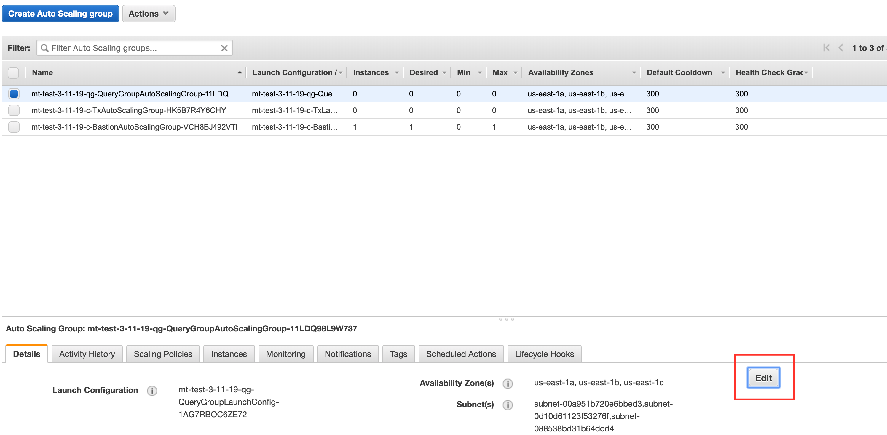

# Turning Off Unused Compute Resources

While you can [delete a compute stack](../../05-operation/02-cloud/15-deleting/deleting.md#deleting-stacks) at any time without loss of data, it is often useful to instead temporarily turn down unused compute capacity in a Datomic system. This is achieved by setting the scaling capacity targets for your compute group's auto-scaling group to 0.

## Adjusting the ASG

### CloudFormation

- Go to [CloudFormation](https://console.aws.amazon.com/cloudformation/home).
- Select the stack that you want to adjust the ASG on.
- Click "Stack actions".
- Click "Update".
- Select "Use current template".
- Click "Next".
- Make your changes in the "Auto scaling configuration" section.
  - Ensure that the other settings match your desired stack configuration.
  - "Minimum number of instances during update" should always be 1 fewer than "Maximum instances".
- Click "Next".
- Acknowledge any capabilities listed.
- Click "Update stack".

### AWS Console (Legacy)

Select your stack (query group or primary compute group) in the [Auto Scaling Group Console](https://console.aws.amazon.com/ec2/autoscaling/home#AutoScalingGroups:view=details) and click the "Edit" button:

In the dialog box that appears, set the *Desired Capacity*, *Min*, and *Max* to 0 and click "Save".

The ASG will terminate all nodes of that compute or query group without removing any of the other system resources. When you wish to re-activate your capacity, edit the same ASG and set the scaling capacity targets back to their original values.

## Legacy

### CLI Tools - Solo Topology (Legacy)

> This section only applies to [Datomic 781-9041](../../11-releases/04-datomic-change-logs/datomic-change-logs.md) and lower.

The `datomic solo` CLI Tool command can be used to set the ASG to 0 or 1 for [solo topology systems](../../05-operation/02-cloud/01-cloud-architecture/cloud-architecture.md).
