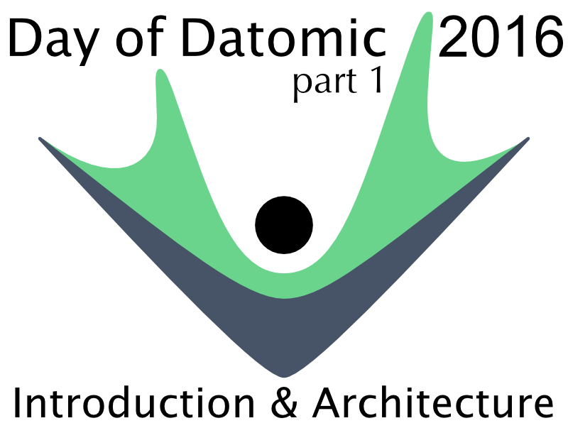
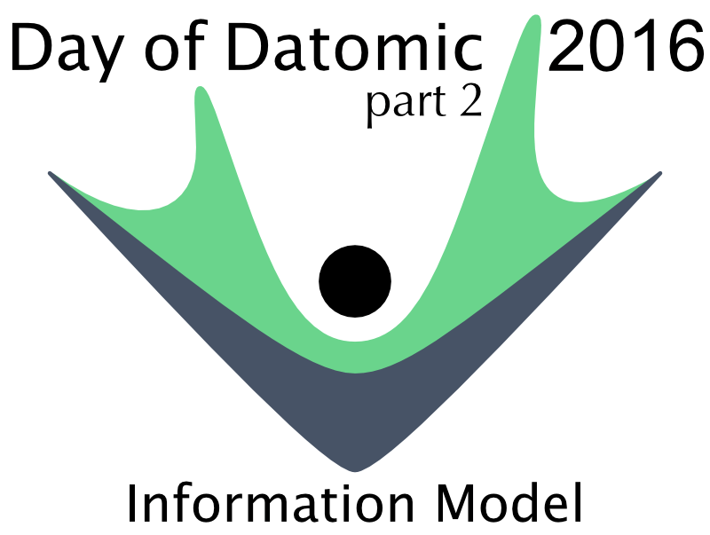
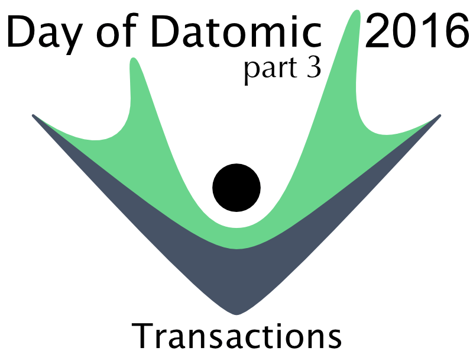
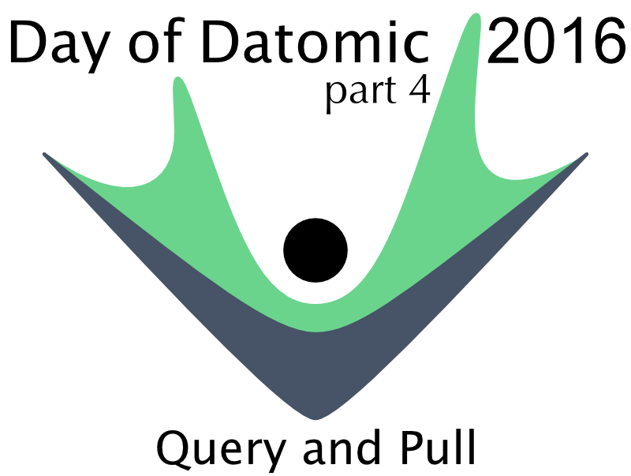
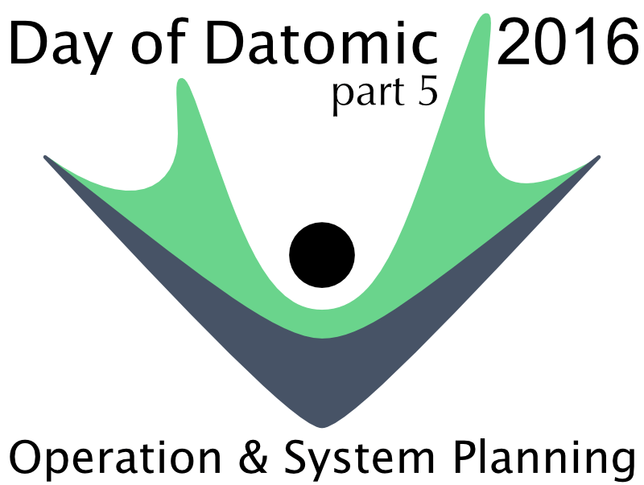
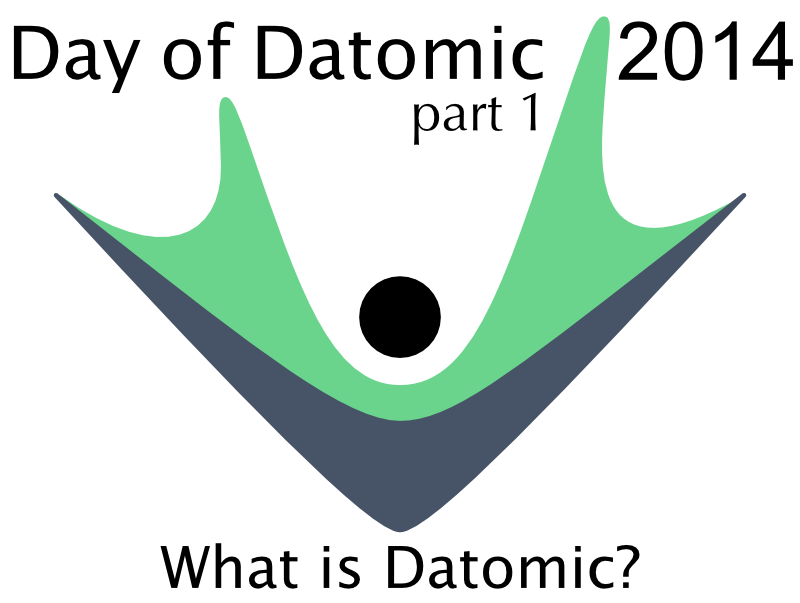
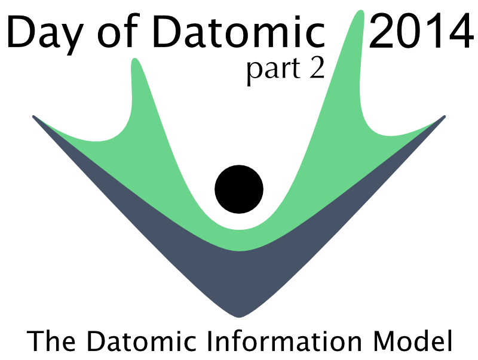
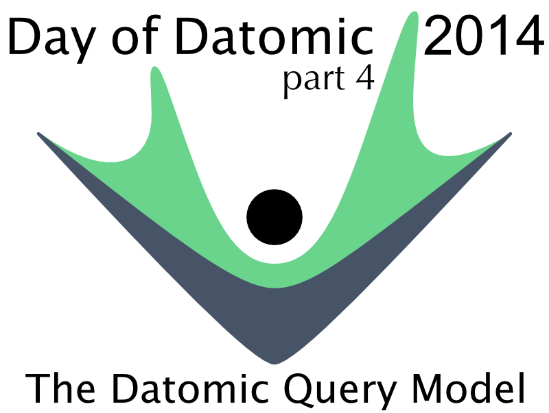
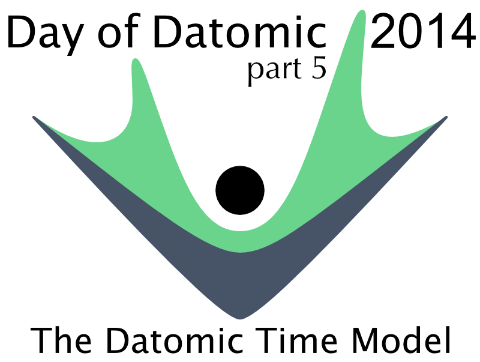
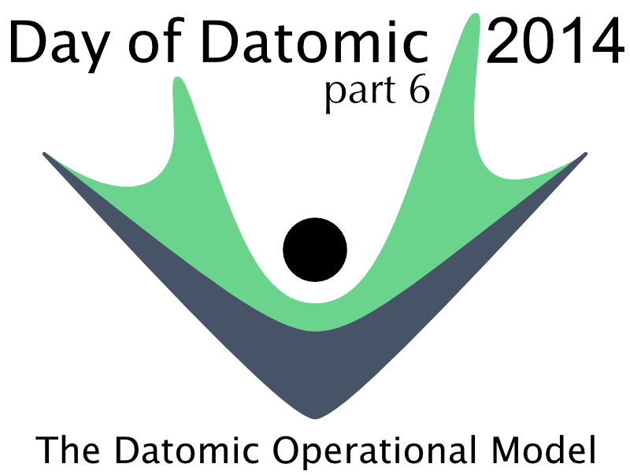

# Day of Datomic

## Day of Datomic 2016

This Day of Datomic series provides an overview of Datomic using the Client library for examples and workshops.

In this video series Stu Halloway presents the fundamentals of Datomic. Divided into five parts, these videos contain everything you need to know to get started with Datomic. You can download the [classroom materials and samples](https://github.com/Datomic/client-examples) to accompany the videos.

### Part I: Introduction & Architecture

In this first video Stu Halloway introduces Datomic and provides an overview of Datomic's architecture.

### Part II: Information Model

In the second video of the series Stu discusses the Datomic information model. Stu covers Datomic's preferred data notation, EDN, and the fundamental unit of data in Datomic, the datom. Stu also covers the topics of Datomic databases, entities, and schema.

### Part III: Transactions

In the third video of the series, Stu covers the Datomic transaction model. This session covers Datomic's ACID transactions and how Datomic allows you to group datoms into entities. Stu also discusses how Datomic handles identity and the related question of uniqueness. This session ends with a discussion of database functions and reified transactions.

### Part IV: Query and Pull

The fourth video in the Day of Datomic series discusses the two primary ways to access data in Datomic: querying with Datalog and via the Pull API. In this session, Stu also covers raw index access and database filters.

### Part V: Operation & System Planning

The final video in the Day of Datomic series covers the operational characteristics of Datomic and the issues you should be aware of when planning your Datomic system. Stu also covers caching in Datomic, indexes, and the indexing process, choosing a storage service, and monitoring your Datomic system. This session was completed with a discussion of Datomic capacity planning.

## Day of Datomic 2014

This Day of Datomic series provides an overview of Datomic using the Peer library for examples and workshops.

In this video series, Stu Halloway presents the fundamentals of Datomic. Divided into six parts and totaling about four hours, these videos contain everything you need to know to get started with Datomic. You can also download the [classroom materials and samples](https://github.com/Datomic/day-of-datomic) to accompany the videos, as well as the [original slides](https://github.com/stuarthalloway/presentations/blob/master/Nov2014/DayOfDatomicNov2014.pdf?raw=true).

### Part I: What Is Datomic?

In Part I, Stu Halloway introduces Datomic. Stu will outline what Datomic is as well as the design philosophy and architectural principles behind it. Stu will also demonstrate getting Datomic installed and running and how you can interact with it via the Datomic console as well as the REST API.

### Part II: The Datomic Information Model

In Part II, Stu turns to the Datomic information model. Stu covers Datomic's preferred data notation, EDN, along with the fundamental unit of data in Datomic, the datom. Stu will also talk about the Datomic ideas of databases, entities, and schemas.

### Part III: The Datomic Transaction Model

With the basics out of the way, Stu now moves on to the Datomic transaction model. In this video, we will see how Datomic is an old-school ACID database, and how Datomic allows you to group datoms into entities. Stu will also discuss how Datomic handles identity and the related question of uniqueness. Finally, Stu will cover database functions, functions that run inside of a transaction.

### Part IV: The Datomic Query Model

In this video, Stu talks about how to get data out of Datomic. Stu starts with the two main ways to query Datomic: querying with Datalog and via the pull API. Stu also covers the raw indexes that underlay Datomic.

### Part V: The Datomic Time Model

Moving on from query, Stu now turns towards the Datomic view of time, which brings us back to transactions and how to use the Datomic log API and filters to navigate through your data. Stu also talks about how to use `sync` to correlate activity across multiple peers. Finally, Stu talks about permanently removing data from Datomic using excision.

### Part VI: The Datomic Operational Model

In this final video, Stu covers the operational characteristics of Datomic along with the issues that you need to be aware of when planning your system. Stu also covers caching in Datomic, as well as indexes and the indexing process, choosing a storage service, and monitoring your Datomic system. Finally, Stu finishes out with a discussion of Datomic capacity planning.

