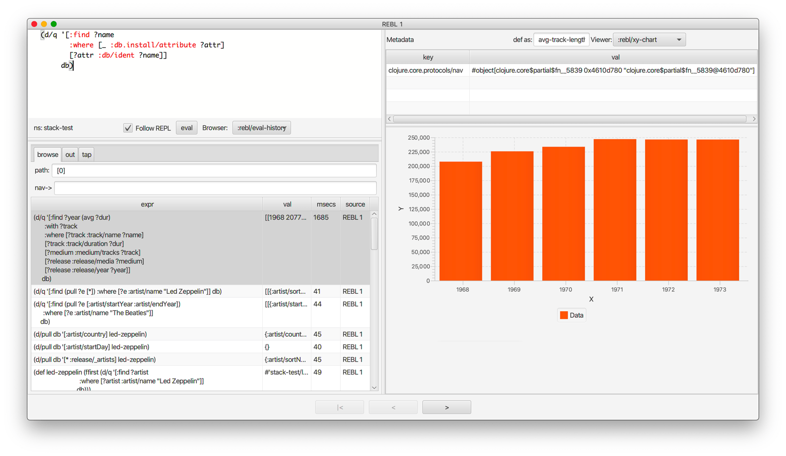
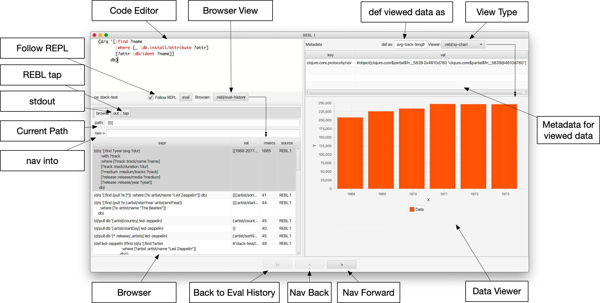

<a id="content"></a>

<a id="cognitect-rebl"></a>

# Cognitect REBL

[](#interface)

<a id="outline-container-introduction"></a>

<a id="introduction"></a>

## Overview

<a id="text-introduction"></a>

REBL is a graphical, interactive tool for browsing Clojure data. REBL is developed by the [Datomic Team](https://www.datomic.com/) at [Cognitect](https://www.cognitect.com/), and is available for non-commercial use (per the [EULA](https://cognitect.com/dev-tools/license.txt)) free of charge. We hope that many Clojure developers will find it useful.

REBL is included with [Cognitect dev-tools](https://cognitect.com/dev-tools/).

- A two-pane browser/viewer system for viewing collections and their contents
- [Navigation into and back out of nested collections](#navforward)
- [A structured editor pane for entering expressions to be evaluated](#code-editor)
- A root browse of a history of expression evaluations
- The ability to 'wrap' a stdio based REPL (e.g. Clojure's native REPL) so that it can monitor and display the interactions therein, while still allowing them to flow back to the host (e.g. the editor)
- When used with [non-stdio repls](#nREPL) (e.g. nREPL), can be launched a la carte and accepts values to inspect via an API call
- The ability to capture nested values as defs in the user namespace
- The ability to run multiple independent UI windows with `cognitect.rebl/ui`
- [Metadata viewing](#metadata)
- Datafy support
- Extensibility to new browsers and viewers
- Full keyboard control via [hotkeys](#keybindings)

<a id="outline-container-release-status"></a>

<a id="release-status"></a>

### Release Status

<a id="text-release-status"></a>

REBL is early access. Your feedback can help make it better. Please report any [issues](https://github.com/cognitect-labs/REBL-distro/issues) that you encounter.

<a id="outline-container-installation"></a>

<a id="installation"></a>

## Installation

<a id="text-installation"></a>

Get the [latest version of Cognitect dev-tools](https://cognitect.com/dev-tools/) and unzip it. From the unzip directory, install the dev-tools with the install script:

``` sh
bash ./install
```

Add the following to `/.clojure/deps.edn` to define an alias to use in all projects, or to a project's local `deps.edn`

``` clojure
{:aliases
 {:rebl        ;; for JDK 11+
  {:extra-deps {com.cognitect/rebl          {:mvn/version "0.9.245"}
                org.openjfx/javafx-fxml     {:mvn/version "15-ea+6"}
                org.openjfx/javafx-controls {:mvn/version "15-ea+6"}
                org.openjfx/javafx-swing    {:mvn/version "15-ea+6"}
                org.openjfx/javafx-base     {:mvn/version "15-ea+6"}
                org.openjfx/javafx-web      {:mvn/version "15-ea+6"}}
   :main-opts ["-m" "cognitect.rebl"]}
  :rebl-jdk8   ;; for JDK 8
  {:extra-deps {com.cognitect/rebl {:mvn/version "0.9.245"}}
   :main-opts ["-m" "cognitect.rebl"]}}}
```

<a id="outline-container-usage"></a>

<a id="usage"></a>

## Usage

<a id="text-usage"></a>

Replace your repl invocation (`clj` or `clojure`) with the appropriate alias for your JDK version:

- JDK 8
  - `clj -A:rebl-jdk8`
- JDK 11+
  - `clj -A:rebl`

Your repl should start, along with the REBL UI. Everything evaluated in your REPL will also appear in REBL. You can also type expressions right into REBL's editor (in the upper left). REBL will maintain a history of exprs+results in the root browse table.

Additional UI's can be started by evaluating `cognitect.rebl/ui` in your editor.

<a id="outline-container-nREPL"></a>

<a id="nREPL"></a>

### nREPL

<a id="text-nREPL"></a>

To use REBL with [nREPL](https://nrepl.org/nrepl/0.8/index.html) or nREPL based editors:

- [Install](#installation) REBL
- [Add nREPL as dependency](https://nrepl.org/nrepl/usage/server.html#using-clojure-cli-tools) to your project.
- Start REBL using the appropriate alias `clj -A:rebl-jdk8:nREPL` or `clj -A:rebl:nREPL` for JDK 11+
- [Start an nREPL server](https://nrepl.org/nrepl/usage/server.html#embedding-nrepl) from inside REBL
- Connect to the nREPL server from your editor of choice.

Forms can be sent to REBL using `cognitect.rebl/inspect`. They will be evaluated and added to the eval-history.

<a id="outline-container-cider"></a>

<a id="cider"></a>

### cider

<a id="text-cider"></a>

[Emacs](https://www.gnu.org/software/emacs/) [cider](https://github.com/clojure-emacs/cider) users can launch REBL automatically and send forms on request via defun-\>keybinding by using the instructions in the [cider-rebl](https://github.com/admiralbumblebee/cider-rebl) repository.

<a id="outline-container-cursive"></a>

<a id="cursive"></a>

### Cursive

<a id="text-cursive"></a>

- [Install](#installation) REBL and the deps.
- Create a new, or use an existing, Clojure Deps project
  - Edit your REPL Configuration to use:
    - REPL type: `clojure.main`
    - Check `Run with Deps:`
    - Enter the appropriate alias: `rebl-jdk8` for JDK 8, or `rebl` for JDK 11+

If you are using nREPL, then please follow the [nREPL Instructions](#nREPL).

<a id="outline-container-limitations"></a>

<a id="limitations"></a>

### Limitations

<a id="text-limitations"></a>

REBL currently requires Java 1.8 or Java 11+

<a id="outline-container-interface"></a>

<a id="interface"></a>

## Interface

<a id="text-interface"></a>


<a id="outline-container-code-editor"></a>

<a id="code-editor"></a>

### Code Editor

<a id="text-code-editor"></a>

The Code Editor is a full-featured editor for writing clojure code. Code is evaluated and the results are immediately available inside the [browser](#browser), out and [tap](#tap) tabs.

[Numerous hotkeys](#keybindings) are available for text editing.

<a id="outline-container-browser"></a>

<a id="browser"></a>

### Browser

<a id="text-browser"></a>

Results of evaluation appear in the Browser pane. When navigating using the forward and [back](#navback) buttons, the current values will appear in the appropriate browser in this pane.

[nav-\>](#navinto) will navigate deeper into data while keeping the current browser view on the data that you're acting upon.

Evaluating new code or navigating back to the root will cause the Browser Pane to return to the evaluation-history.

<a id="outline-container-browser-viewer"></a>

<a id="browser-viewer"></a>

### Browser Viewer

<a id="text-browser-viewer"></a>

Data in the browser can be displayed in a variety of ways. The Browser View drop-down lists the current available views for the data displayed in the Browser.

<a id="outline-container-data-viewer"></a>

<a id="data-viewer"></a>

### Data Viewer

<a id="text-data-viewer"></a>

The data currently selected in the [Browser](#browser) will be displayed in the Data Viewer using the currently selected [viewer](#view-type).

<a id="outline-container-view-type"></a>

<a id="view-type"></a>

### Data Viewer Type

<a id="text-view-type"></a>

A number of viewers are available for different shapes and types of data.

<a id="outline-container-def-as"></a>

<a id="def-as"></a>

### def as:

<a id="text-def-as"></a>

Typing a [valid clojure symbol name](https://clojure.org/reference/reader#_symbols) into the `def as:` text box and pressing enter will [def](https://clojure.org/reference/vars) bind the data shown in the [Data Viewer](#data-viewer) to that var in the user namespace.

Vars are def'd in the `user` name space.

This is often useful when navigating deep into data and you want to extract the data in the [Data Viewer](#data-viewer).

<a id="outline-container-metadata"></a>

<a id="metadata"></a>

### Metadata Viewer

<a id="text-metadata"></a>

The Metadata Viewer displays the [Metadata](https://clojure.org/reference/metadata) for the data currently displayed in the [Data Viewer](#data-viewer)

<a id="outline-container-navforward"></a>

<a id="navforward"></a>

### Nav Forward

<a id="text-navforward"></a>

The forward button (`Command-Right`) [navs](https://clojure.github.io/clojure/branch-master/clojure.core-api.html#clojure.core.protocols/nav) into the data selected in the [Data Viewer](#data-viewer) and the current value is moved to the [Browser](#browser).

If [`nav->`](#navinto) is currently being used, then it will be added to the [path](#currentpath) when navigating forward.

<a id="outline-container-navback"></a>

<a id="navback"></a>

### Nav Back

<a id="text-navback"></a>

The back button (`Command-Left`) [navs](https://clojure.github.io/clojure/branch-master/clojure.core-api.html#clojure.core.protocols/nav) to the previous value in the navigation history.

If [`nav->`](#navinto) was used while navigating forward, then the full `nav->` path that was used will be treated as a single nav step while navigating back.

<a id="outline-container-navroot"></a>

<a id="navroot"></a>

### Back to eval-history

<a id="text-navroot"></a>

This button (`Shift-Command-Left`) will navigate back to the evaluation history.

<a id="outline-container-follow-repl"></a>

<a id="follow-repl"></a>

### Follow REPL

<a id="text-follow-repl"></a>

If launching REBL [normally](#installation), REBL will follow all REPL interactions. The Follow REPL checkbox controls whether this is active or not.

<a id="outline-container-stdout"></a>

<a id="stdout"></a>

### out

<a id="text-stdout"></a>

The out tab shows `*out*` for the REBL repl.

<a id="outline-container-tap"></a>

<a id="tap"></a>

### tap

<a id="text-tap"></a>

REBL [adds a tap](https://clojure.github.io/clojure/branch-master/clojure.core-api.html#clojure.core/add-tap) and calls to [tap](https://clojure.github.io/clojure/branch-master/clojure.core-api.html#clojure.core/tap%3E) will be displayed here.

The resulting values from REBL's tap can be cleared, or loaded into the [Data View](#data-viewer) with the `browse` button.

<a id="outline-container-currentpath"></a>

<a id="currentpath"></a>

### path:

<a id="text-currentpath"></a>

`path:` displays the currently navigated path starting with the index in the eval-history.

<a id="outline-container-navinto"></a>

<a id="navinto"></a>

### nav-\>

<a id="text-navinto"></a>

nav-\> allows you to supply a set of keys or a set of parenthesized forms to navigate forward in the currently selected collection without changing the relationship between the [Current Browser](#browser) and [Data Viewer](#data-viewer) panes.

The [Data Viewer](#data-viewer) will `nav->` to the data, but the [Browser](#browser) will remain unchanged.

`nav->` remains in effect while browsing the eval-history, so if you have a number of results which require the same navigational steps, this can be entered into `nav->` and all browsing will utilize those steps.

<a id="outline-container-rebl-datomic"></a>

<a id="rebl-datomic"></a>

## REBL and Datomic

<a id="text-rebl-datomic"></a>

Datomic entities are automatically navigated via [pull](../../06-reference/03-query-and-pull/03-pull/pull.md).

<a id="outline-container-datafied-files"></a>

<a id="datafied-files"></a>

## Datafied Filetypes

<a id="text-datafied-files"></a>

REBL will datafy java.io.Files that contain data to return the contents of those files, as described below:

| Extension | Format | Library Required (Tested With) |
|----|----|----|
| .csv | csv | [data.csv 0.1.4](https://github.com/clojure/data.csv) |
| .edn | edn | (none) |
| .properties | Java properties |   |
| .json | json | [data.json 0.2.3](https://github.com/clojure/data.json) |
| .yml, .yaml | YAML | [snakeyaml 1.23](https://bitbucket.org/asomov/snakeyaml/src/master/) |

<a id="outline-container-browsable-files"></a>

<a id="browsable-files"></a>

### Browsable Files

<a id="text-browsable-files"></a>

REBL will open a [WebView](https://docs.oracle.com/javase/8/javafx/api/javafx/scene/web/WebView.html) on java.io.Files whose name returns a text/ or image/ mimetype from the configured Java [FileNameMap](https://docs.oracle.com/javase/7/docs/api/java/net/URLConnection.html#getFileNameMap()).

<a id="outline-container-keybindings"></a>

<a id="keybindings"></a>

## Current Keybindings

<a id="text-keybindings"></a>

<a id="outline-container-editor-keys"></a>

<a id="editor-keys"></a>

### Editor Keys

<a id="text-editor-keys"></a>

| Command | Key | Command | Key |
|----|----|----|----|
| Add Cursor Above | Option-Command-Up | Expand Select | Control-Shift-Command-Right |
| Add Cursor Below | Option-Command-Down | Find | Command-F |
| Add Cursors to Line Ends | Shift-Option-L | Find Next | Command-G |
| Add Line Comment | Command-K Command-c | Find Next Selection | Command-F3 |
| Add To Next Find Match | Command-D | Find Previous | Shift-Command-G |
| Backspace | Backspace | Find Previous Selection | Shift-Command-F3 |
| Backward sexp | Option-Left | Find With Selection | Command-E |
| Backward sexp mark | Shift-Option-Left | Fold | Option-Command-\[ |
| Backward Up sexp | Option-Up | Fold All | Command-K Command-0 |
| Barf sexp Backward | Control-Option-Right | Fold All Block Comments | Command-K Command-/ |
| Barf sexp Forward | Control-Left | Fold All Regions | Command-K Command-8 |
| Change All Occurrences | Command-F2 | Fold Level 1 | Command-K Command-1 |
| Copy | Command-C | Fold Level 2 | Command-K Command-2 |
| Copy Line Down | Shift-Option-Down | Fold Level 3 | Command-K Command-3 |
| Copy Line Up | Shift-Option-Up | Fold Level 4 | Command-K Command-4 |
| Cut | Command-X | Fold Level 5 | Command-K Command-5 |
| Delete | Delete | Fold Level 6 | Command-K Command-6 |
| Delete All Left | Command-Backspace | Fold Level 7 | Command-K Command-7 |
| Delete All Right | Control-K | Fold Recursively | Command-K Command-\[ |
| Delete Line | Shift-Command-K | Format Document | Shift-Option-F |
| Evaluate Code | Control-Enter | Format Selection | Command-K Command-F |

| Command | Key | Command | Key |
|----|----|----|----|
| paredit-open-round | ( | paredit-forward-slurp-sexp | Control-Right |
| paredit-open-square | \[ | paredit-backward-slurp-sexp | Control-Option-Left |
| paredit-open-curly | { | backward-sexp-mark | Option-Shift-Left |
| paredit-forward | Option-Right | forward-sexp-mark | Option-Shift-Right |
| paredit-backward | Option-Left | paredit-split-sexp | Option-Shift-S |
| paredit-backward-up | Option-Up | paredit-splice-sexp | Option-S |
| paredit-forward-down | Option-Down | paredit-kill | Control-K |
| paredit-reindent-defun | Option-Q | paredit-kill-backward | Control-Shift-K |
| paredit-forward-barf-sexp | Control-Left | paredit-delete | Delete |
| paredit-backward-barf-sexp | Control-Option-Right | paredit-backspace | Backspace |

<a id="outline-container-application-keys"></a>

<a id="application-keys"></a>

### App Keys

<a id="text-application-keys"></a>

| Command                    | Key                |
|----------------------------|--------------------|
| Nav Forward                | Command-Right      |
| Nav Backwards              | Command-Left       |
| Nav to Root (Eval History) | Shift-Command-Left |
| Focus Browse               | Control-B          |
| Focus View                 | Control-V          |
| Focus Browse Choice        | Shift-Control-B    |
| Focus View Choice          | Shift-Control-V    |
| Focus Code Entry           | Control-R          |

<a id="outline-container-release-history"></a>

<a id="release-history"></a>

## Release History

<a id="text-release-history"></a>

<a id="outline-container-245"></a>

<a id="245"></a>

### 0.9.245

<a id="text-245"></a>

- Upgrade Clojure to 1.11.1

<a id="outline-container-244"></a>

<a id="244"></a>

### 0.9.244

<a id="text-244"></a>

- Update core.async to 1.5.648
- Update cljfmt to 0.8.0

<a id="outline-container-0-9-242"></a>

<a id="0-9-242"></a>

### 0.9.242

<a id="text-0-9-242"></a>

- Provide dev-tools via Cognitect maven repo

<a id="outline-container-0-9-220"></a>

<a id="0-9-220"></a>

### 0.9.220

<a id="text-0-9-220"></a>

- Improvement: Added copy functionality to the viewer.
- Improvement: Keep the cursor in view while navigating with selected text.

<a id="outline-container-0-9-218"></a>

<a id="0-9-218"></a>

### 0.9.218

<a id="text-0-9-218"></a>

- This version of REBL replaces the embedded code editor (formerly CodeMirror) with Monaco, the editor engine used in VS Code. While this was a good bit of work under the hood, superficially it might not seem like a lot. This will give us a framework for more features. The first of these is proper paredit support (replacing the parinfer we had before). Please see the Hotkeys page for more details.
- Monaco has a lot of features already, e.g. code folding (press F1 in the editor to see and search for commands and their keystrokes), and provides hooks for many language editing tasks which we hope to wire up over time.
- At present the keybindings are still hardwired, but we plan to offer user-customized bindings.
- Speaking of bindings there is a significant change to the default nav bindings - they now conform to the browser standards (Command-L/R, which was always intended but problematic before).

<a id="outline-container-0-9-170"></a>

<a id="0-9-170"></a>

### 0.9.170

<a id="text-0-9-170"></a>

- [fixed incompatibility with Java 11](https://github.com/cognitect-labs/REBL-distro/issues/30)
- nav-\> to nil returns nil

<a id="outline-container-0-9-168"></a>

<a id="0-9-168"></a>

### 0.9.168

<a id="text-0-9-168"></a>

- add a path of keys or parenthesized expressions to browser "nav-\>" to transform the elements in the viewer
- browser "path" shows the path your browsing took
- tap view has a "browse" button so that you can browse tap results as data
- column sorts now use Clojure's compare where possible

<a id="outline-container-0-9-157"></a>

<a id="0-9-157"></a>

### 0.9.157

<a id="text-0-9-157"></a>

- new var nav now shows runtime deps (:rebl.var/uses and :rebl.var/used-by) and :rebl/source if available
- string expressions with code can now use the code viewer
- fixed nav for sets
- fixes <https://github.com/cognitect-labs/REBL-distro/issues/24>
- fixes <https://github.com/cognitect-labs/REBL-distro/issues/23>

<a id="outline-container-0-9-149"></a>

<a id="0-9-149"></a>

### 0.9.149

<a id="text-0-9-149"></a>

- Datafy support for csv, edn, json, and yaml files.
- Tap pane now shows a list of recent tap\> values.
- "def as…" now works correctly with unprintable/unreadable Objects.

<a id="outline-container-0-9-109"></a>

<a id="0-9-109"></a>

### 0.9.109

<a id="text-0-9-109"></a>

- Initial release.
